<p align="center"></p>

# OpenScaler

[](https://github.com/kojunpyo/OpenScaler/actions/workflows/build.yml)
[](https://github.com/kojunpyo/OpenScaler/releases/latest)
[](LICENSE)

**창 모드 게임을 실시간으로 캡처해, 더 선명하게 키우고 더 부드럽게 보여 주는 오픈소스 Windows 프로그램**

게임을 고치지 않고 화면만 보고 동작하므로 어떤 게임에도 쓸 수 있습니다. 상용 프로그램 [Lossless Scaling](https://store.steampowered.com/app/993090/Lossless_Scaling/)의 핵심 기능인 업스케일링과 프레임 생성을 오픈소스로 직접 구현했습니다.

여기에 더해, OpenScaler는 **쓸수록 그 게임에 맞춰집니다.** 게임을 하는 동안 만든 프레임을 스스로 채점하고, 점수가 오르는 쪽으로 게임마다 설정을 고쳐 나갑니다 ([게임별 학습](#5-게임별-학습)). 화면은 저장하지 않으며, 게임마다 35KB 이하의 파일 하나만 남깁니다.


> 30fps 영상을 640×360 창에서 2560×1440으로 확대. 왼쪽 일반 확대 30fps, 오른쪽 OpenScaler(FSR 1.0 + RIFE) 60fps. 차이를 보기 쉽도록 0.5배속으로 재생합니다. 영상: [Why is NieR: Automata's combat so satisfying?](https://www.youtube.com/watch?v=z6La_S9YoJ4) (Shen One)

---

## 목차

장 제목을 누르면 세부 항목이 펼쳐집니다.

<details>
<summary>1. 왜 필요한가</summary>

- [1.1 낮은 해상도로 돌리면 화면이 흐려진다](#11-낮은-해상도로-돌리면-화면이-흐려진다)
- [1.2 프레임이 낮으면 고주사율 모니터가 소용없다](#12-프레임이-낮으면-고주사율-모니터가-소용없다)
- [1.3 게임마다 맞는 설정이 다르다](#13-게임마다-맞는-설정이-다르다)
- [1.4 그래서 게임 밖에서 처리하고, 게임에 맞춰 스스로 조정한다](#14-그래서-게임-밖에서-처리하고-게임에-맞춰-스스로-조정한다)

</details>

[2. 핵심 기능](#2-핵심-기능)

<details>
<summary>3. 설치와 사용법</summary>

- [3.1 다운로드](#31-다운로드)
- [3.2 사용법](#32-사용법)
- [3.3 단축키](#33-단축키)
- [3.4 슬로모션 테스트](#34-슬로모션-테스트)
- [3.5 RIFE 엔진](#35-rife-엔진)
- [3.6 설정 파일](#36-설정-파일)
- [3.7 문제 해결](#37-문제-해결)

</details>

<details>
<summary>4. 상세 기능</summary>

- [4.1 화면 확대](#41-화면-확대)
- [4.2 프레임 생성](#42-프레임-생성)
- [4.3 확인과 비교](#43-확인과-비교)
- [4.4 마우스와 편의 기능](#44-마우스와-편의-기능)

</details>

<details>
<summary>5. 게임별 학습</summary>

- [5.1 어떻게 배우나](#51-어떻게-배우나)
- [5.2 효과](#52-효과)
- [5.3 학습 데이터 관리](#53-학습-데이터-관리)
- [5.4 학습 데이터 공유](#54-학습-데이터-공유)

</details>

<details>
<summary>6. 성능 평가</summary>

- [6.1 평가 기준: 정확성, 즉각성](#61-평가-기준-정확성-즉각성)
- [6.2 성능 평가](#62-성능-평가)
  - [6.2.1 마인크래프트 (일반 게임)](#621-마인크래프트-일반-게임)
  - [6.2.2 DJMAX RESPECT V (리듬게임)](#622-djmax-respect-v-리듬게임)
  - [6.2.3 측정 조건과 참고](#623-측정-조건과-참고)

</details>

<details>
<summary>7. 동작 원리</summary>

- [7.1 마우스 좌표 변환](#71-마우스-좌표-변환)
- [7.2 프레임 생성](#72-프레임-생성)
- [7.3 FSR 1.0 구현](#73-fsr-10-구현)

</details>

[8. 알려진 한계](#8-알려진-한계)

<details>
<summary>9. 개발과 기여</summary>

- [9.1 직접 빌드하기](#91-직접-빌드하기)
- [9.2 기술 스택](#92-기술-스택)
- [9.3 프로젝트 구조](#93-프로젝트-구조)
- [9.4 학습 데이터 올리기](#94-학습-데이터-올리기)

</details>

[10. 로고와 글꼴](#10-로고와-글꼴)

[11. 참고 자료](#11-참고-자료)

[12. 라이선스](#12-라이선스)


---

## 1. 왜 필요한가

### 1.1 낮은 해상도로 돌리면 화면이 흐려진다

게임이 버거울 때 프레임을 올리는 가장 확실한 방법은 해상도를 낮추는 것입니다. 1920×1080 대신 1280×720으로 돌리면 그릴 픽셀이 절반 아래로 줄어듭니다. 하지만 그 화면을 모니터에 꽉 채우면 모니터나 그래픽 드라이버가 주변 픽셀을 단순히 섞어 늘리므로 글자와 윤곽선이 뿌옇게 번지고, 창 모드로 두면 화면 가운데에 작은 창으로 남습니다. 성능이 충분해도 같은 문제가 생기는 경우가 있습니다.

- **해상도가 고정된 게임**: 오래된 게임, 인디 게임, 에뮬레이터는 640×480이나 1280×720만 지원하기도 합니다.
- **픽셀 아트 게임**: 섞어서 늘리면 각진 그림이 뭉개집니다. 정확히 2배, 3배로 키워야 원래 모양이 유지됩니다.
- **고해상도 모니터**: 1440p나 4K 모니터에서는 더 많이 늘려야 해서 더 흐려집니다.

### 1.2 프레임이 낮으면 고주사율 모니터가 소용없다

144Hz나 240Hz 모니터도 게임이 30fps나 60fps로만 나오면 그만큼만 부드럽습니다. 게임이 실제로 그린 프레임(이 문서에서는 "게임 프레임") 사이에 새 프레임을 넣는 "프레임 생성"이 해결책이지만, NVIDIA DLSS 프레임 생성이나 AMD FSR 3는 게임 개발사가 직접 넣어 줘야 하고, DLSS 프레임 생성은 최신 NVIDIA 그래픽카드에서만 동작합니다.

### 1.3 게임마다 맞는 설정이 다르다

화면만 보고 프레임을 만들려면 앞뒤 프레임에서 무엇이 어디로 움직였는지 추측해야 하는데, 잘 맞는 값(움직임을 찾는 칸의 크기, 찾는 범위, 주변과 다른 움직임을 얼마나 믿을지)이 게임마다 다릅니다. 리듬게임은 생김새가 같은 노트가 빠르게 내려와 서로 헷갈리기 쉽고, 횡스크롤 게임은 화면 전체가 흘러 넓게 찾아야 하며, 체력 바나 점수처럼 고정된 글자 위로 물체가 지나가는 게임도 있습니다. 사용자가 이런 값을 직접 맞추고 맞았는지 확인하기는 어렵습니다.

### 1.4 그래서 게임 밖에서 처리하고, 게임에 맞춰 스스로 조정한다

OpenScaler는 게임과 상관없이 **화면만 보고** 처리합니다. 게임을 낮은 해상도의 창 모드로 실행하면 그 창을 실시간으로 캡처해 윤곽선을 살리는 알고리즘으로 모니터 크기까지 키우고, 원하면 게임 프레임 사이에 움직임을 맞춘 프레임을 넣어 주사율까지 채웁니다. 결과는 전체화면으로 덮어 보여 주고 마우스 클릭은 그대로 게임에 전달합니다. 게임을 하는 동안에는 만든 프레임을 정답과 비교해 채점하며 그 게임에 맞는 설정을 찾아 기억합니다.

같은 일을 하는 Lossless Scaling은 유료이고 소스가 공개되어 있지 않으며, 오픈소스인 [Magpie](https://github.com/Blinue/Magpie)는 업스케일링에 집중합니다. OpenScaler는 업스케일링과 프레임 생성을 함께 오픈소스로 구현하고 게임별 학습을 더했습니다. 또 각 단계(화면 캡처, GPU 셰이더, 움직임 추정, 신경망 실행, 입력 처리)가 어떻게 동작하는지 코드로 보여 주는 것을 목표로 합니다.

| | 화면 확대 | 프레임 생성 | 게임 지원 필요 | 게임에 맞춰 스스로 조정 | 그래픽카드 | 소스 공개 |
|---|---|---|---|---|---|---|
| 모니터, 드라이버의 기본 확대 | 단순 섞기 (흐림) | 없음 | 아니요 | - | 모두 | - |
| DLSS, FSR 3 (게임 내장) | 있음 | 있음 | **예** | 해당 없음 (게임이 움직임 정보를 줌) | 제품마다 다름 | 일부 |
| Lossless Scaling | 있음 | 있음 | 아니요 | 아니요 (설정은 사용자가 고름) | 모두 | 아니요 (유료) |
| **OpenScaler** | 있음 | 있음 | 아니요 | **예 (게임별 학습)** | Direct3D 11 GPU | **예 (MIT)** |

---

## 2. 핵심 기능

- **선명한 업스케일**: 게임 창을 모니터 크기로 키웁니다. 기본값인 AMD FSR 1.0은 윤곽선의 방향을 보고 보간해 글자와 테두리가 번지지 않습니다.
- **프레임 생성**: 게임 프레임 사이(보간)나 다음 게임 프레임 전(외삽)에 움직임을 맞춘 프레임을 넣어, 30fps 게임도 모니터 주사율만큼 부드럽게 보여 줍니다.
- **게임별 학습**: 게임마다 생성 결과를 스스로 채점하며 설정을 맞추고, 화면에서 자주 움직이는 곳을 기억합니다. 쓸수록 그 게임에 맞춰집니다. 화면은 저장하지 않습니다 ([자세히](#5-게임별-학습)).
- **그대로 쓰는 마우스**: 확대된 화면에서 클릭한 곳이 원래 게임 창의 같은 위치로 들어갑니다.

---

## 3. 설치와 사용법

### 3.1 다운로드

[Releases](https://github.com/kojunpyo/OpenScaler/releases/latest)에서 `OpenScaler-windows-x64.zip`을 받아 압축을 풀면 됩니다. 설치는 필요 없습니다.

필요한 환경: Windows 10 1903 이상 또는 Windows 11, Direct3D 11을 지원하는 그래픽카드

### 3.2 사용법

<p align="center"></p>

1. 게임을 **창 모드**로, 모니터보다 낮은 해상도(예: 1280×720)로 실행합니다.
2. `OpenScaler.exe`를 실행하면 설정 창이 열립니다.
3. **대상 창** 목록에서 게임을 고르고 **확대 시작**을 누릅니다. 게임 창을 클릭한 뒤 **Alt+Shift+S**를 눌러도 됩니다.
4. 확대 화면 오른쪽에 메뉴가 열리고, 가운데에 "프레임 생성 영역을 지정할까요?"를 묻습니다 (아래 설명). 그냥 쓰려면 **아니오**를 누릅니다.
5. 멈출 때는 **Alt+Shift+S**를 누릅니다. 설정 창을 닫으면 프로그램이 종료됩니다.

<table>
<tr>
<td align="center" width="33%">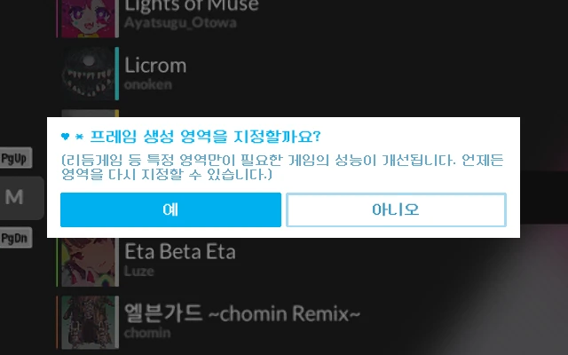</td>
<td align="center" width="33%">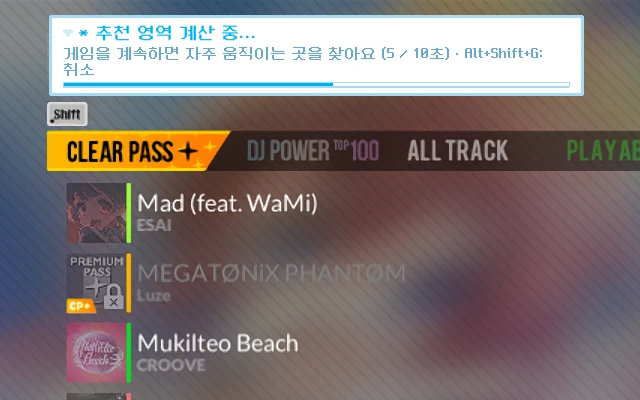</td>
<td align="center" width="33%">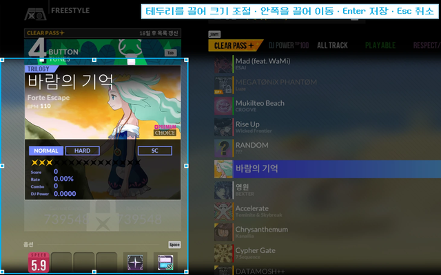</td>
</tr>
<tr>
<td align="center">① 확대를 시작하면 묻는 팝업</td>
<td align="center">② <b>예</b>를 누르면 추천 영역 계산</td>
<td align="center">③ 추천 영역을 다듬고 Enter로 저장</td>
</tr>
</table>

**프레임 생성 영역 지정**: 팝업에서 **예**를 누르면 위쪽에 "추천 영역 계산 중..."이 뜹니다. 10초쯤 게임을 계속하면 자주 움직인 곳을 감싼 영역이 편집 창에 그려지고, 테두리를 끌어 크기를, 안쪽을 끌어 위치를 다듬은 뒤 Enter로 저장합니다 (Esc는 취소, 계산 중 취소는 Alt+Shift+G). 저장하거나 취소하면 메뉴가 다시 열립니다. 화면 대부분이 움직이는 게임이면 직접 지정할지 묻습니다. 프레임 생성이 꺼져 있었다면 **예**를 누를 때 켭니다. 프레임 생성은 메뉴, 설정 창, **Alt+Shift+F**로도 켜고 끕니다.

<p align="center">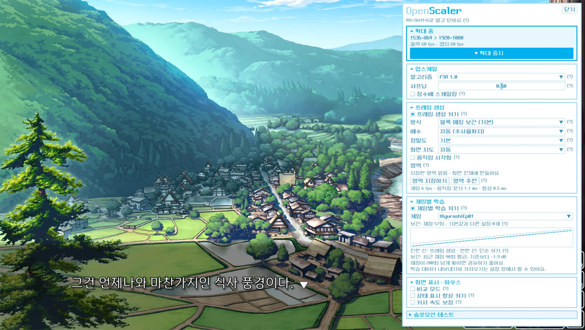</p>

**확대 화면 위 메뉴**: 확대 화면이 설정 창을 덮어도, 메뉴(**Alt+Shift+G**로 열고 닫음)에서 설정 창과 같은 설정(업스케일, 프레임 생성, 영역 지정과 추천, 슬로모션, 게임별 학습, 화면 표시)을 마우스로 바꿀 수 있어 모니터가 하나여도 됩니다. 메뉴를 눌러도 게임 창의 포커스는 그대로라 게임이 멈추지 않습니다. 1인칭 게임처럼 커서를 창 가운데 붙잡아 두는 게임은 게임의 메뉴(Esc)를 먼저 열어야 메뉴를 누를 수 있습니다. 학습 데이터 내보내기와 가져오기는 파일 창이 확대 화면 뒤로 숨으므로 설정 창에서만 합니다.

### 3.3 단축키

| 단축키 | 기능 |
|---|---|
| Alt+Shift+S | 지금 활성 창 확대 시작/중지 |
| Alt+Shift+M | 업스케일 알고리즘 변경 |
| Alt+Shift+↑ / ↓ | 샤프닝 강도 조절 (0.0 \~ 1.0) |
| Alt+Shift+I | 정수배 스케일링 켜기/끄기 |
| Alt+Shift+F | 프레임 생성 켜기/끄기 |
| Alt+Shift+C | 비교 모드 켜기/끄기 |
| Alt+Shift+O | 화면 위 상태 표시 항상 켜기/끄기 (끄면 설정을 바꿀 때만 잠깐 표시) |
| Alt+Shift+P | 커서 속도 보정 켜기/끄기 |
| Alt+Shift+T | 슬로모션 테스트 시작/끝내기 |
| Alt+Shift+G | 확대 화면 위 메뉴 열기/닫기 (모니터가 하나일 때) |
| Alt+Shift+Q | 종료 |

### 3.4 슬로모션 테스트

고주사율 모니터가 없어도 만든 프레임을 볼 수 있게, 1초쯤 녹화해 모니터 주사율만큼(120Hz보다 낮으면 120Hz) 채운 뒤 느리게 재생합니다. 확대 중 Alt+Shift+T로 시작하고 끝냅니다. 설정 창에서는 오른쪽 아래의 접힌 **슬로모션 테스트**를 펼쳐 주사율과 녹화 길이를 고르고 녹화할 수 있습니다. 재생 중에는 Alt+Shift+Space로 멈추고 Alt+Shift+←/→로 한 장씩 넘깁니다. 실제 지연과 끊김은 이 테스트로 알 수 없습니다.

### 3.5 RIFE 엔진

릴리스 zip에는 RIFE 엔진에 필요한 `rife` 폴더(약 57MB)가 들어 있어, 압축을 풀고 설정 창의 **방식**에서 **RIFE 보간**을 고르면 바로 쓸 수 있습니다. 처음 고르면 신경망을 준비하느라 몇 초 걸리고, 그동안은 블록 매칭을 씁니다. `rife` 폴더를 지우면 블록 매칭만 씁니다.

신경망은 Windows의 DirectML로 돌리므로 그래픽카드 제조사에 묶이지 않습니다. 그래픽카드가 둘인 노트북에서는 성능이 높은 쪽을 고릅니다.

### 3.6 설정 파일

바꾼 설정은 실행 파일 옆의 `OpenScaler.ini`에 자동으로 저장되고 다음 실행 때 그대로 불러옵니다. 비교 모드는 확인용이라 저장하지 않습니다.

```ini
[Settings]
Mode=fsr              ; nearest, bilinear, bicubic, lanczos2, fsr
Sharpness=0.5         ; 0.0 ~ 1.0
IntegerScale=0        ; 1이면 정수배 스케일링
AlwaysShowStatus=0    ; 1이면 화면 위 상태 표시를 항상 켬
AdjustCursorSpeed=0   ; 1이면 커서 속도 보정
FrameGen=0            ; 1이면 프레임 생성
FgMethod=0            ; 0: 보간, 1: 외삽 (설정 창의 방식이 외삽이면 1)
FgGenerator=0         ; 0: 블록 매칭 (기본값), 1: RIFE
FgQuality=1           ; 정밀도. 0: 낮음, 1: 기본, 2: 높음
FgPreset=0            ; 화면 지도. 0: 자동, 1: 끔
```

게임별 학습 기록은 실행 파일 옆 `profiles` 폴더에 게임마다 저장됩니다 ([학습 데이터 관리](#53-학습-데이터-관리)).

### 3.7 문제 해결

| 증상 | 해결 |
|---|---|
| 게임 화면이 캡처되지 않습니다 | 전용 전체화면(Exclusive Fullscreen)은 캡처할 수 없습니다. 게임을 창 모드로 실행하세요 |
| 144Hz 모니터인데 확대 화면이 초당 60장으로 나옵니다 | Windows 10은 주 모니터의 주사율로 화면을 합성합니다. 고주사율 모니터를 주 모니터로 두세요 |
| 고주사율에서 화면이 가끔 끊깁니다 | NVIDIA 제어판 → 3D 설정 관리 → 프로그램 설정에서 OpenScaler의 전원 관리 모드를 "최대 성능 선호"로 바꾸세요. 그래도 끊기면 프레임 생성 영역을 움직이는 부분만 지정합니다 (**영역 추천**) |
| 같은 장면이 두 번씩 나와 덜컥거립니다 | 배수를 **자동**으로 두세요. 2배, 3배로 고정하면 주사율을 게임 fps로 고르게 나누지 못할 때가 있습니다 |
| 프레임 생성을 켜도 부드러워지지 않습니다 | 게임 fps가 주사율의 87% 이상이면 넣을 자리가 없어 프레임 생성이 쉽니다. Alt+Shift+O로 상태 표시를 켜서 게임 fps를 확인하세요 |
| RIFE 보간이 동작하지 않습니다 | 릴리스 zip의 `rife` 폴더가 `OpenScaler.exe` 옆에 있어야 합니다. 처음 고르면 신경망을 준비하는 몇 초 동안은 블록 매칭을 씁니다 |
| 확대 화면에서 커서가 너무 빠릅니다 | 커서 속도 보정(Alt+Shift+P)을 켜세요 |
| 비정상 종료 뒤 마우스 속도가 바뀌어 있습니다 | OpenScaler를 다시 실행하면 원래 속도로 되돌립니다 |
| 클릭이 다른 창으로 갑니다 | 게임 창과 확대 화면 사이에 다른 창이 겹치지 않게 하세요 |
| 확대 화면 위 메뉴를 누를 수 없습니다 | 커서를 붙잡아 두는 게임(1인칭 게임 등)은 게임의 메뉴(Esc)를 열어 커서를 풀어 주세요 |
| 게임 창 둘레에 노란 테두리가 보입니다 | Windows 10이 캡처 중인 창에 그리는 표시이며 동작에는 영향이 없습니다 (Windows 11에서는 숨김) |

---

## 4. 상세 기능

### 4.1 화면 확대

| 기능 | 설명 |
|---|---|
| 업스케일 알고리즘 5종 | Nearest, Bilinear, Bicubic(Catmull-Rom), Lanczos2, FSR 1.0 (기본값) |
| 샤프닝 | 확대로 흐려진 윤곽선을 또렷하게 합니다. 강도 0\~1 (FSR은 RCAS, 나머지는 대비 적응형 샤프닝) |
| 정수배 스케일링 | 2배, 3배처럼 정수 배율로만 키워 픽셀 아트의 픽셀이 고르게 커집니다 |
| 게임 화면만 확대 | 창의 제목 표시줄과 테두리는 빼고 게임 화면만 키웁니다. 비율은 유지하고 남는 곳은 검은 여백으로 채웁니다 |

<details>
<summary>알고리즘 비교</summary>

| 알고리즘 | 특징 | 용도 |
|---|---|---|
| Nearest | 가장 가까운 픽셀을 그대로 복사. 계단 현상이 있지만 가장 빠름 | 픽셀 아트, 레트로 게임 |
| Bilinear | 주변 2×2 픽셀을 선형 보간. 부드럽지만 흐림 (모니터의 기본 확대와 비슷함) | 비교 기준 |
| Bicubic | 주변 4×4 픽셀을 3차 곡선으로 보간. Bilinear보다 선명 | 일반 게임 |
| Lanczos2 | sinc 함수 기반 4×4 보간 + 링잉 억제 | 일반 게임 |
| FSR 1.0 | AMD의 EASU가 윤곽선 방향을 분석해 보간하고, RCAS로 샤프닝. 윤곽선이 가장 깔끔함 | 일반 게임 (기본값) |

640×360 테스트 패턴을 1920×1080(3배)으로 확대한 결과입니다.


</details>

### 4.2 프레임 생성

| 기능 | 설명 |
|---|---|
| 방식: 블록 매칭 보간 (기본값) | 화면을 작은 칸으로 나눠 앞뒤 게임 프레임에서 같은 모양을 찾고, 두 프레임 사이에 중간 프레임을 만듭니다. [게임별 학습](#5-게임별-학습)이 게임마다 값을 맞추므로 쓸수록 그 게임에 맞춰집니다. 화면이 게임 프레임 한 장만큼 늦어집니다 |
| 방식: RIFE 보간 | 신경망([RIFE](https://github.com/hzwer/Practical-RIFE))으로 움직임을 찾아 중간 프레임을 만듭니다. 빠른 움직임과 밝기 변화에 강하지만 GPU를 더 쓰고, 신경망 시간만큼 더 늦어집니다. 게임별 학습은 적용되지 않습니다 ([RIFE 엔진](#35-rife-엔진)) |
| 방식: 블록 매칭 외삽 (실험) | 지금까지의 움직임으로 다음 게임 프레임이 오기 전 장면을 미리 만듭니다. 화면이 늦어지지 않지만 덜 정확합니다 |
| 배수 | 주사율까지 자동으로 채우거나 2배, 3배, 4배로 고정합니다 |
| 정밀도 | 움직임을 찾는 영상의 해상도를 낮음, 기본, 높음 중에서 고릅니다. RIFE가 제때 끝나지 못하면 해상도를 자동으로 낮춥니다 |
| 게임별 학습과 화면 지도 | 만든 프레임을 스스로 채점해 게임마다 설정을 맞추고, 자주 움직이는 곳과 방향을 기억합니다 ([게임별 학습](#5-게임별-학습)) |
| 프레임 생성 영역 | 리듬게임의 건반처럼 움직이는 곳만 골라 그 안에서만 프레임을 만들고 학습합니다. 확대 중 **영역 지정하기**를 누르면 확대 화면 위에 사각형이 뜨고, 테두리를 끌어 크기를, 안쪽을 끌어 위치를 정한 뒤 Enter로 저장합니다. 게임마다 따로 기억하고, 영역 밖은 게임 화면을 그대로 보여 줍니다. DJMAX 720p에서 가운데 절반만 지정하면 움직임 찾기는 66%, 합성은 59%의 시간으로 줄었습니다 (GTX 1060) |
| 영역 추천 | 프레임 생성을 켜고 10초쯤 플레이한 뒤 **영역 추천**을 누르면, 최근 10초 동안 자주 바뀐 곳을 감싼 사각형을 영역 편집 창에 그려 줍니다. 다듬어서 Enter로 저장합니다. DJMAX에서는 건반과 판정선을 찾았고(배경 영상은 은은하게 바뀌어 빠짐), 시점이 움직이는 마인크래프트에서는 "화면 대부분이 움직여서 좁힐 곳이 없어요"라고 알려 줍니다 |
| 움직임 시각화 | 찾아낸 움직임을 색(방향)과 진하기(빠르기)로 보여 줍니다 (블록 매칭, 외삽) |

방식은 세 가지 중에서 고릅니다. 대부분은 기본값인 블록 매칭 보간을 그대로 쓰면 되고, 빠른 움직임에서 화면이 자주 깨지면 RIFE 보간, 화면이 늦어지는 것이 싫으면 블록 매칭 외삽을 고릅니다. "보간"과 "외삽"은 프레임을 어디에 만드는지(두 게임 프레임 사이인지, 최근 프레임 다음인지), "블록 매칭"과 "RIFE"는 움직임을 어떻게 찾는지를 뜻합니다. 어떤 방식이 어느 정도의 결과를 내는지는 [성능 평가](#6-성능-평가)에 있습니다.

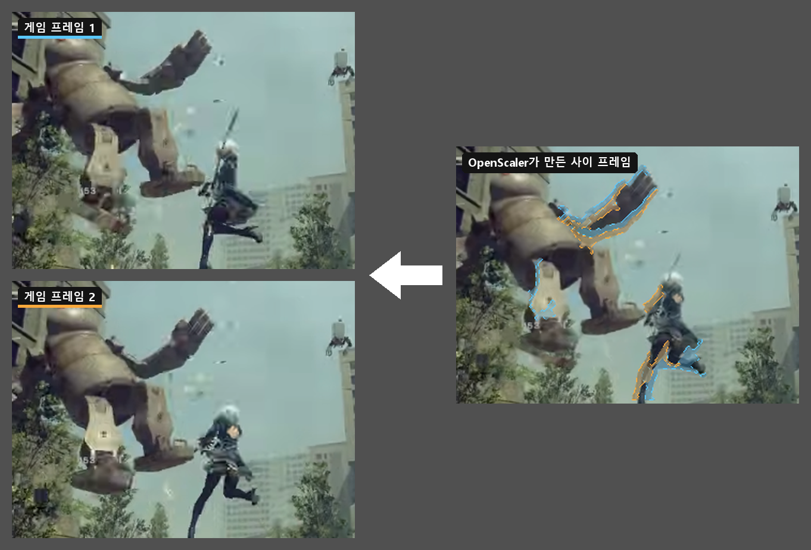

> 시연 영상에서 가져온 연속된 게임 프레임 두 장(왼쪽)과, OpenScaler가 그 사이에 만든 프레임(오른쪽). 색 잔상과 점선은 움직인 로봇 팔과 인물이 게임 프레임 1(파랑)과 2(주황)에서 있던 자리이고, 만든 프레임은 그 중간 위치에 그립니다.

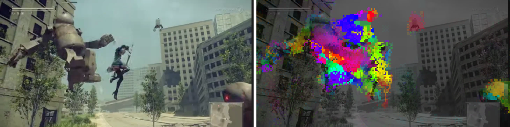

> 시연 영상의 게임 화면(왼쪽)과, 움직임 시각화를 켜면 보이는 화면(오른쪽)입니다. 블록 매칭이 찾아낸 움직임을 칸마다 방향은 색으로, 빠르기는 진하기로 칠합니다. 뛰어오르는 인물과 로봇, 위쪽의 작은 비행체처럼 움직인 곳만 칠해지고, 멈춰 있는 건물과 하늘, 화면 구석의 UI는 원래 화면이 어둡게 비칩니다. 같은 물체 안에서도 색이 갈리는 곳은 부분마다 다르게 움직였거나, 움직임을 잘못 찾아 프레임이 깨지기 쉬운 곳입니다.

### 4.3 확인과 비교

| 기능 | 설명 |
|---|---|
| 비교 모드 | 화면을 반으로 나눠 왼쪽은 일반 확대(프레임 생성 없음), 오른쪽은 OpenScaler 결과를 보여 줍니다 |
| 슬로모션 테스트 | 짧게 녹화해 고주사율 모니터만큼 프레임을 채운 뒤 느리게 재생합니다. 기본값은 모니터 주사율이고, 60Hz 모니터에서는 120Hz로 만듭니다. 고주사율 모니터가 없어도 생성된 프레임을 모두 볼 수 있습니다 |
| 화면 위 상태 표시 | 알고리즘, 해상도, 출력 fps, 게임 fps, 움직임 찾기와 합성 시간을 확대 화면 구석에 표시합니다 |

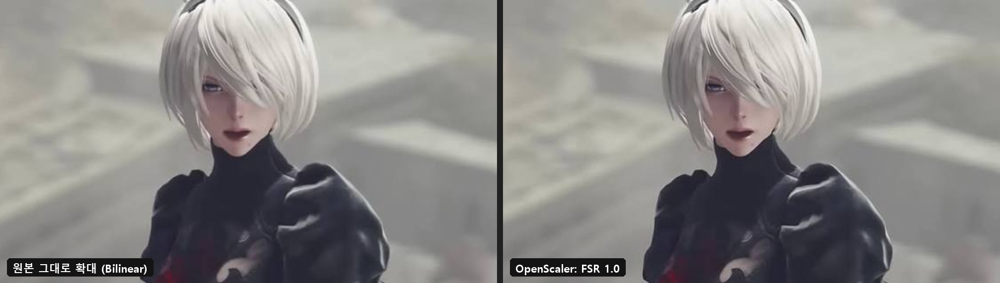

> 311×160 이미지를 1920×1080 화면으로(약 6배) 키운 결과에서 얼굴 부분을 화면 픽셀 그대로 잘라 나란히 붙였습니다. 왼쪽은 원본을 그대로 늘린 일반 확대(Bilinear, 샤프닝 없음), 오른쪽은 OpenScaler의 FSR 1.0에 샤프닝을 가장 세게(1.0) 준 결과입니다. 왼쪽은 머리카락 가닥과 눈매, 입술 경계가 번지지만, 오른쪽은 윤곽이 또렷합니다. 기본 샤프닝(0.5)은 이보다 부드럽습니다.

### 4.4 마우스와 편의 기능

| 기능 | 설명 |
|---|---|
| 마우스 좌표 변환 | 확대된 화면에서 클릭한 위치를 원래 창의 위치로 옮겨 전달하고, 커서는 확대된 위치에 그립니다 |
| 커서 속도 보정 | 확대하면 화면상 커서가 배율만큼 빨라집니다. 켜면 확대 중에만 Windows 마우스 속도를 낮춰 원래 속도에 맞춥니다 |
| 설정 창 | 대상 창 선택부터 모든 옵션을 한 화면에서 바꿉니다 |
| 단축키 | 게임 중에도 Alt+Shift 조합으로 조작합니다 |
| 설정 저장 | 바꾼 설정은 실행 파일 옆 `OpenScaler.ini`에 자동 저장됩니다 |

---

## 5. 게임별 학습

OpenScaler는 프레임 생성을 켜고 게임을 확대하는 동안 스스로 결과를 채점하고, 그 게임에 더 맞는 설정을 찾아 기억합니다. 다음에 같은 게임을 확대하면 학습한 설정으로 바로 시작합니다.

### 5.1 어떻게 배우나

정답이 있어야 채점할 수 있는데, 화면만 보는 프로그램에는 "생성한 프레임의 정답"이 없습니다. 그래서 정답을 아는 상황을 만들어 시험합니다.

1. **문제 내기**: 1초에 한 번, 이어진 게임 프레임 세 장(A, B, C) 중 가운데 B를 가립니다.
2. **풀기**: A와 C만 보고 B 자리의 프레임을 만듭니다. 지금 설정과 시험할 후보 설정으로 한 번씩 만듭니다.
3. **채점**: 만든 프레임을 진짜 B와 비교해 점수(PSNR, dB)를 매깁니다. 계산은 모두 GPU에서 하고 화면은 바로 버립니다.
4. **고치기**: 후보를 6번 시험해 평균이 0.05dB 넘게 좋으면 채택합니다. 다섯 가지 값을 하나씩 돌아가며 후보를 바꿉니다.
5. **되돌아보기**: 메뉴나 결과 화면에서 고른 값이 게임 화면에서는 나쁠 수 있으므로, 세 번에 한 번은 기본값을 후보로 다시 시험해 더 나으면 되돌립니다.

**외삽은 따로 배웁니다.** 외삽은 다음 게임 프레임을 보지 않고 미리 만들기 때문에, 잘 맞는 값이 보간과 다릅니다. 그래서 블록 매칭 외삽을 쓰는 동안에는 문제를 이렇게 바꿉니다.

1. **문제 내기**: 이어진 게임 프레임 세 장(A, B, C) 중 마지막 C를 가립니다.
2. **풀기**: A와 B만 보고 C가 올 시각의 장면을 예측합니다. 실제 외삽과 같은 방법입니다.
3. **채점**: 예측한 장면을 진짜 C와 비교합니다. 기준은 "B를 그대로 보여 줬을 때"(프레임 생성이 없을 때)입니다.

고치기와 되돌아보기는 보간과 같고, 학습한 값은 보간용과 외삽용을 따로 저장합니다.

함께 **화면 지도**도 쌓습니다. 화면을 32×18칸으로 나눠, 칸마다 자주 움직이는지, 주로 어느 방향으로 움직이는지를 평균 냅니다. 리듬게임이라면 노트가 내려오는 줄, 고정된 UI 자리가 드러납니다. 지도는 채점에서 더 좋게 나올 때만 움직임 찾기의 후보로 씁니다.

| 학습하는 값 | 뜻 | 기본값 |
|---|---|---|
| 칸 크기 | 움직임을 몇 픽셀 단위로 찾을지. 작을수록 작은 물체를 따라가고, 클수록 덜 흔들림 | 4픽셀 |
| 찾는 범위 | 한 프레임 사이에 얼마나 멀리 움직인 것까지 찾을지 | 12 |
| 벌점 | 주변과 다른 움직임을 얼마나 의심할지 | 0.0015 |
| 허용 밝기 차이 | 앞뒤 프레임을 합칠 때 어느 정도 다른 픽셀까지 섞을지 | 0.08 |
| 화면 지도 | 지도를 움직임 찾기에 쓸지 | 안 씀 |

설정 창의 **게임별 학습** 구역에서 게임마다 보간과 외삽 각각의 채점 횟수와 기본값과 다른 값의 개수를 볼 수 있고, 옆의 (?)에 설정을 바꾼 횟수와 학습된 값이 있습니다. 점수 그래프는 지금 고른 방식의 것을 보여 줍니다 (보간은 두 장을 단순히 섞은 결과, 외삽은 앞 프레임을 그대로 둔 결과와 함께).

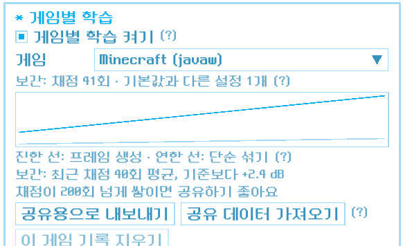

> 학습 기록이 없는 상태에서 마인크래프트(게임 30fps, 시점을 계속 돌림)를 5분 동안 확대하며 설정 창의 게임별 학습 구역을 찍고, 그래프가 나타난 뒤(채점 약 40회) 그래프가 바뀐 장면만 이었습니다 (약 20초마다 한 번). 진한 선(프레임 생성)이 연한 선(단순 섞기)보다 위에 있습니다. 5분 동안 채점 278회, 기본값과 다르게 바뀐 설정 3개(칸 8, 벌점 0.0005, 허용 밝기 차이 0.14)였고 최근 채점 평균은 단순 섞기보다 3.6dB 높았습니다. 그래프의 높낮이는 그때 화면이 얼마나 빨리 움직였는지에 따라 함께 오르내립니다.

<details>
<summary><b>자세히: 어떤 값이 어떻게 바뀌나, 학습 과정의 의사 코드, 핵심 수식</b></summary>

**학습하는 값과 후보**

값마다 후보가 세 개(화면 지도는 둘) 있고, 한 번에 하나만 바꿔 지금 값과 겨룹니다.

| 값 | 후보 | 기본값 | 들어가는 곳 (아래 수식) | 바뀌면 |
|---|---|---|---|---|
| 칸 크기 | 4 / 8 / 16픽셀 | 4 | 움직임 벡터 v를 하나씩 정하는 격자 | 작을수록 작은 물체를 따라가지만 계산이 늘고 흔들림 |
| 찾는 범위 | 8 / 12 / 16 | 12 | ② 가장 작게 줄인 단계(원본의 1/16)에서 v를 찾는 반경 | 넓을수록 빠른 움직임을 잡지만 엉뚱한 곳과 맞을 수 있음 |
| 벌점 λ | 0.0005 / 0.0015 / 0.004 | 0.0015 | ② 둘째 항 | 클수록 주변과 같은 방향으로 맞춰져 덜 흔들리지만 작은 물체를 놓침 |
| 허용 밝기 차이 τ | 0.04 / 0.08 / 0.14 | 0.08 | ③ 가중치 w의 지수, 가려진 곳 판정 | 클수록 덜 맞는 후보도 섞어 부드럽지만 잔상이 남음 |
| 화면 지도 | 안 씀 / 씀 | 안 씀 | ② 후보 v에 지도의 평소 움직임을 더함 | 노트 줄처럼 늘 같은 방향으로 움직이는 곳을 빨리 찾음 |

**학습 과정 (의사 코드)**

`src/game_profile.cpp`의 `FgLearner::NextCandidate`, `AddEvaluation`을 줄인 것입니다.

```text
매초:
    게임 프레임 A, B, C를 고른다          # 외삽이면 C를 가리고 A, B로 예측
    현재값으로 B' 만들기,  후보로 B'' 만들기,  기준으로 B0 만들기   # 기준: 보간은 단순 섞기, 외삽은 앞 프레임 그대로
    차이 목록에 PSNR(B'', B) - PSNR(B', B)를 넣는다      # 수식 ①
    점수 기록에 PSNR(B', B)와 PSNR(B0, B)를 넣는다     # 그래프, 20회마다 한 점

    차이가 6개 모이면:
        후보가 기본값이면:
            채택 = (차이의 중앙값 > 0) 그리고 (후보가 이긴 횟수 >= 3)
        아니면:
            m = 후보가 칸을 줄이면 0.15dB, 아니면 0.05dB
            채택 = (차이의 평균 > m)                         # 수식 ④
        채택이면 현재값 = 후보
        다음 후보 고르기

다음 후보 고르기:
    세 번에 한 번, 현재값이 기본값과 다르면 → 후보 = 기본값      # 되돌아보기
    아니면 → 칸 크기 → 찾는 범위 → 벌점 → 허용 차이 → 화면 지도 순으로
             하나만 다른 후보로 바꾼다 (화면 지도는 지도 표본이 20개 넘어야 시험)
```

- 기본값으로 돌아갈 때만 평균 대신 중앙값과 이긴 횟수로 봅니다. 한 장면에서 크게 이긴 한 번에 끌려가지 않게 하려는 것이고, 손해를 막는 방향이라 기준을 낮게 둡니다.
- 칸을 줄이는 후보는 계산이 늘어나므로 더 크게(0.15dB) 이겨야 채택합니다.
- 6번 겨루는 데 약 6초가 걸리고, 후보 하나가 채택되거나 버려집니다. 다섯 값을 한 바퀴 도는 데 1\~2분 걸립니다.

**핵심 수식**

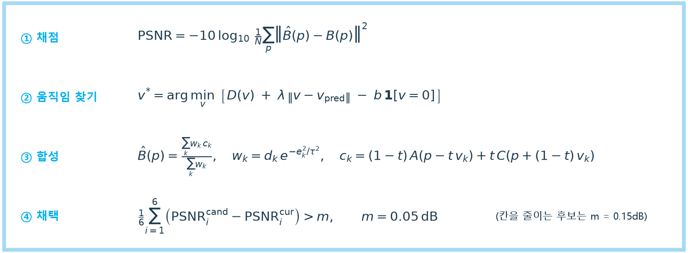

- **① 채점**: 만든 프레임 B̂와 진짜 B의 평균 제곱 오차를 dB로 바꿉니다. 높을수록 정답에 가깝고, 3dB 높으면 오차가 절반입니다.
- **② 움직임 찾기**: 칸마다 앞뒤 프레임의 같은 내용을 가장 잘 잇는 벡터 v를 고릅니다. D(v)는 칸 안 13개 점의 밝기 차이 평균, v<sub>pred</sub>는 한 단계 작은 영상에서 찾은 벡터, b는 움직임 없음을 조금 우대하는 값입니다. 영상을 1/16까지 줄여 넓게 찾은 뒤 단계마다 두 배로 키우며 다듬습니다. **찾는 범위**와 **벌점 λ**가 여기서 바뀝니다.
- **③ 합성**: 픽셀 p를 둘러싼 네 칸의 벡터 v<sub>k</sub>(와 움직임 없음)로 앞 프레임 A와 뒤 프레임 C를 시점 t만큼 따라가 색 c<sub>k</sub>를 만들고, 앞뒤가 잘 맞는(오차 e<sub>k</sub>가 작은) 후보에 무게를 둬 평균합니다. d<sub>k</sub>는 칸 중심까지의 거리 가중치입니다. **허용 밝기 차이 τ**가 클수록 덜 맞는 후보도 섞입니다. 외삽은 t > 1이라 앞의 두 장 사이 움직임을 이어 갑니다.
- **④ 채택**: 같은 문제 6개에서 후보가 평균 m보다 많이 이겨야 바꿉니다. 한두 번의 측정 오차로 값이 흔들리지 않게 하려는 기준입니다.
- **화면 지도**: 32×18칸마다 움직이는 비율, 멈춘 비율, 주된 방향을 m ← m + 0.05 × (이번 값 − m)으로 천천히 따라가며 평균합니다. 노트 줄은 "자주 아래로", 고정 UI는 "화면이 움직여도 멈춤"으로 남습니다.

</details>

### 5.2 효과

같은 영상의 앞 절반으로 학습하고, 학습에 쓰지 않은 뒤 절반에서 기본값과 비교했습니다 (GTX 1060).

| 영상 | 학습 전 → 학습 후 |
|---|---|
| 계산으로 만든 장면 6가지 (화면 이동, 고정 UI, 작은 물체, 리듬게임 노트, 빠른 이동, 밝기 변화) | 장면마다 +1.3 \~ +13.2dB |
| DJMAX RESPECT V 플레이 녹화 3개, 다른 화면이 섞인 경우까지 21가지 | 평균 +0.34dB, 가장 나쁜 경우 -0.60dB (21가지 중 1번 나빠짐) |
| 마인크래프트 Java판 시점 회전 녹화 1개, 다른 화면이 섞인 경우까지 7가지 | 7가지 모두 좋아짐, +0.09 \~ +1.60dB |
| 외삽: DJMAX 녹화 3개 × 7가지 (30fps 게임을 외삽하는 간격) | 21가지 모두 좋아짐, 평균 +2.06dB (+0.02 \~ +3.46dB) |
| 외삽: 마인크래프트 녹화 1개 × 7가지 | 7가지 모두 좋아짐, +0.03 \~ +0.44dB |

- 학습은 블록 매칭 보간(기본값)과 블록 매칭 외삽의 값을 각각 바꿉니다. RIFE 보간은 미리 학습된 신경망을 그대로 쓰므로, RIFE를 고르면 채점과 화면 지도는 쌓이지만 RIFE의 결과는 바뀌지 않습니다.
- DJMAX에서 외삽의 기본값은 프레임 생성이 없을 때의 오차 중 53%를 없앴고, 학습 후에는 77%를 없앴습니다 (첫 녹화, 다른 화면이 섞이지 않은 경우).
- 실제 게임을 오래 하면서 체감이 좋아지는지는 아직 확인하지 못했습니다.

### 5.3 학습 데이터 관리

- **화면은 저장하지 않습니다.** 채점에 쓴 프레임은 GPU 메모리에서 바로 버리고, 디스크에는 숫자로 된 결과만 남깁니다. 인터넷으로 보내는 것도 없습니다.
- **게임마다 파일 하나**: 실행 파일 옆 `profiles` 폴더에 `게임 실행 파일 이름.json`으로 저장합니다. 마인크래프트 Java판의 `javaw`처럼 여러 게임이 함께 쓰는 실행 파일이면 창 제목에서 버전 번호와 뒤쪽 상태 표시를 뺀 이름을 붙여 `Minecraft (javaw).json`처럼 구분합니다. 보간용과 외삽용 학습값(각 다섯 개), 화면 지도, 점수 기록, 채점 횟수가 들어 있습니다.
- **크기가 정해져 있습니다**: 화면 지도는 칸 수가 고정이고, 점수 기록은 보간과 외삽 각각 채점 20번마다 한 점씩 최근 240점까지만 남깁니다. 저장할 때마다 파일을 새로 덮어쓰므로 오래 써도 커지지 않습니다. 오래 학습한 게임도 파일 하나가 26KB 정도이고, 점수 기록이 가득 차도 35KB를 넘지 않아 게임 100개를 학습해도 3.5MB 이하입니다.
- **저장 시점**: 확대 중 1분마다, 그리고 확대를 멈출 때 저장합니다. 프로그램이 갑자기 꺼져도 최근 1분 안쪽의 학습만 잃습니다.
- **지우기와 끄기**: 설정 창의 게임별 학습 구역에서 게임을 고르고 **이 게임 기록 지우기**를 누르면 그 파일을 지웁니다. `profiles` 폴더를 통째로 지워도 됩니다. **게임별 학습 켜기**를 끄면 채점도 하지 않습니다.

### 5.4 학습 데이터 공유

잘 학습된 데이터는 **공유용으로 내보내기**로 파일을 만들어 다른 사람에게 줄 수 있고, 받은 사람은 **공유 데이터 가져오기**로 넣어 그 상태에서 이어서 학습합니다. 더 좋아지면 다시 공유합니다. 게임마다 가장 좋은 데이터는 [`shared-profiles`](shared-profiles) 폴더에 모읍니다.

- **내보내기**: 설정 창 **게임별 학습** 구역에서 게임을 고르고 **공유용으로 내보내기**를 누릅니다. 파일 이름(`게임 이름.json`)은 바꾸지 않는 것이 좋습니다.
- **가져오기**: `shared-profiles`에서 파일을 받아 **공유 데이터 가져오기**로 고릅니다. 이미 그 게임의 데이터가 있으면 `profiles\backup` 폴더로 옮겨 두므로 되돌릴 수 있습니다.
- **언제 공유하나**: 설정 창의 "최근 채점 200회 평균, 기준보다 +dB"가 공유의 기준입니다. 기준은 보간이면 앞뒤 프레임을 단순히 섞은 것, 외삽이면 앞 프레임을 그대로 둔 것입니다. 채점이 200회(프레임 생성을 켜고 3\~4분) 넘게 쌓인 뒤가 좋습니다.
- 파일에는 학습값, 화면 지도, 점수 기록, 프레임 생성 영역만 들어 있고 화면, 컴퓨터 이름, 경로는 없습니다. 저장소에 올리는 방법은 [9.4 학습 데이터 올리기](#94-학습-데이터-올리기)에 있습니다.

---

## 6. 성능 평가

"프레임 생성이 잘 된다"는 말만으로는 어느 정도인지 알 수 없습니다. OpenScaler는 프레임 생성을 두 가지 기준으로 숫자를 매깁니다. 만든 프레임이 실제 게임 장면과 얼마나 같은지(**정확성**), 화면을 제때, 고르게, 늦지 않게 내는지(**즉각성**)입니다. 측정 도구가 같은 기준으로 등급을 출력합니다 (`tools/test/fgquality.py`, `tools/test/fgtiming.py`).

### 6.1 평가 기준: 정확성, 즉각성

**정확성: 프레임 생성이 없을 때의 오차를 얼마나 없앴나**

정답을 아는 상황을 만들어 비교합니다. 60fps로 녹화한 게임 프레임에서 하나 건너 하나를 빼면 30fps 게임과 같아지고, 뺀 프레임이 정답이 됩니다. 정답 자리에 무엇을 보여 주느냐에 따라 오차가 달라집니다.

- **멈춤 (생성 없음)**: 앞 프레임을 그대로 보여 줍니다. 프레임 생성을 끈 화면과 같습니다. 이 오차가 기준(0%)입니다.
- **단순 섞기**: 앞뒤 프레임을 반씩 섞습니다. 가장 값싼 방법이라, 이보다 확실히 나아야 의미가 있습니다.
- **OpenScaler**: 움직임을 찾아 만든 프레임입니다.

**오차 감소율** = 멈춤의 오차(평균 제곱 오차) 중 몇 %를 없앴는가. 100%면 정답과 같습니다.

| 등급 | 오차 감소율 | 화면에서 보이는 모습 |
|---|---|---|
| 좋음 | 85% 이상 | 움직이는 물체가 제자리에 있고, 깨짐은 멈춰 놓고 찾아야 보입니다 |
| 보통 | 65 \~ 85% | 대부분 맞지만 고정된 글자나 조준점 위, 빠른 물체 가장자리에 흔적이 남습니다 |
| 아쉬움 | 40 \~ 65% | 단순 섞기보다는 낫지만 잔상이나 블록 모양 깨짐이 자주 보입니다 |
| 나쁨 | 40% 미만 | 단순 섞기(보통 30\~40%) 수준입니다 |

dB(PSNR)도 함께 적습니다. 숫자가 감이 오지 않으면 픽셀 하나가 정답과 평균 몇 단계(0\~255) 다른지로 읽으면 됩니다.

| PSNR | 20dB | 25dB | 30dB | 35dB | 40dB |
|---|---|---|---|---|---|
| 평균 픽셀 오차 | 25.5단계 (10%) | 14.3단계 (5.6%) | 8.1단계 (3.2%) | 4.5단계 (1.8%) | 2.6단계 (1.0%) |

나뭇잎처럼 잔무늬가 많은 화면은 조금만 어긋나도 오차가 크게 나와 dB만으로는 게임끼리 비교하기 어렵습니다. 그래서 등급은 같은 화면의 "멈춤"과 비교한 오차 감소율로 매깁니다.

**즉각성: 부드러운가, 늦지 않은가**

실제로 게임을 확대하며 화면마다 기록한 로그(`--fg-log`)로 잽니다. "칸"은 모니터가 화면을 한 번 그리는 시간입니다 (60Hz면 16.7ms, 144Hz면 6.9ms). 그래서 주사율이 달라도 같은 기준을 씁니다.

| 항목 | 뜻 | 좋음 | 보통 |
|---|---|---|---|
| 출력 fps / 주사율 | 모니터가 그릴 때마다 새 화면을 냈는가 | 98% 이상 | 90% 이상 |
| 출력 끊김 | 화면이 1.5칸 넘게 늦게 나온 횟수 | 분당 1번 이하 | 분당 6번 이하 |
| 화면 속 시간 고르기 | 화면마다 게임 속 시간이 고르게 흐르는가 (흔들림의 표준편차) | 0.25칸 이하 | 0.5칸 이하 |
| 멈춤 | 같은 장면이 두 번 나온 비율 | 1% 이하 | 5% 이하 |
| 건너뜀 | 게임 속 시간이 2칸 넘게 한꺼번에 흐른 횟수 | 분당 1번 이하 | 분당 6번 이하 |
| 추가 지연 | 보간이 원래 늦추는 게임 프레임 한 장 외에 더 늦어진 시간 | 10ms 이하 | 25ms 이하 |
| RIFE를 제때 쓴 비율 | 신경망 결과가 늦어 블록 매칭으로 대신하지 않은 비율 | 95% 이상 | 80% 이상 |

### 6.2 성능 평가

일반 게임은 **마인크래프트**(Java판, 854×480, 시점을 계속 돌림)로 대표해, 게임 fps와 화면 주사율을 바꿔 가며 쟀습니다. 리듬게임 **DJMAX RESPECT V**(1280×720)는 두 가지 조건만 쟀고 [6.2.2](#622-djmax-respect-v-리듬게임)에 따로 요약했습니다. 모든 측정은 GTX 1060 노트북 한 대에서 했고, 확대는 FSR 1.0입니다. 비교 대상은 상용 프로그램 Lossless Scaling 3.2.2(LSFG 3.1)입니다.

**한눈에 보기** (마인크래프트)

- **끊김은 모든 간격에서 OpenScaler가 적었습니다.** 블록 매칭은 Lossless Scaling의 2\~15%, RIFE는 7\~56%만 끊겼습니다. 화면에 새 장면을 낸 비율도 OpenScaler가 3\~32% 높았습니다.
- **정확성은 간격에 따라 갈렸습니다.** 30fps를 144fps로 채울 때(사이에 넣을 장면이 많을 때)는 OpenScaler가 조금 더 정확했고, 30fps를 60fps로 채울 때는 Lossless Scaling이 더 정확했습니다. 화면 전체가 움직이는 장면에서 블록 매칭이 특히 약했고, RIFE는 Lossless Scaling에 가까웠습니다.
- **화면에 나오기까지는 Lossless Scaling이 빨랐습니다.** OpenScaler는 수직 동기화에 맞춰 화면을 내서 Lossless Scaling보다 2\~10ms 늦었습니다.
- 정리하면 OpenScaler는 **고르게 보이는 것**에서 앞서고, **반응 속도**와 **화면 전체가 움직일 때의 정확성**에서는 뒤집니다.

**요약 표** (Lossless Scaling = 100%. 초록은 OpenScaler가 10% 넘게 나은 값, 빨강은 10% 넘게 못한 값)

| 간격 | 끊김<br>블록 매칭 | 끊김<br>RIFE | 표시까지 걸린 시간<br>블록 매칭 | 표시까지 걸린 시간<br>RIFE | 오차 감소율<br>블록 매칭 | 오차 감소율<br>RIFE |
|---|---|---|---|---|---|---|
| | *낮을수록 좋음* | *낮을수록 좋음* | *낮을수록 좋음* | *낮을수록 좋음* | *높을수록 좋음* | *높을수록 좋음* |
| 30fps → 60fps | $`\color{green}{\mathsf{2\%}}`$ | $`\color{green}{\mathsf{7\%}}`$ | $`\color{red}{\mathsf{189\%}}`$ | $`\color{red}{\mathsf{186\%}}`$ | $`\color{red}{\mathsf{53\%}}`$ | 93% |
| 60fps → 144fps | $`\color{green}{\mathsf{15\%}}`$ | - | $`\color{red}{\mathsf{127\%}}`$ | - | - | - |
| 30fps → 144fps | $`\color{green}{\mathsf{7\%}}`$ | $`\color{green}{\mathsf{56\%}}`$ | $`\color{red}{\mathsf{111\%}}`$ | $`\color{red}{\mathsf{111\%}}`$ | 104% | $`\color{green}{\mathsf{114\%}}`$ |

- "-"는 Lossless Scaling과 같은 조건으로 재지 않은 칸입니다. 60fps → 144fps의 RIFE는 이 노트북(GTX 1060)에서 144Hz를 따라가지 못했습니다 ([8. 알려진 한계](#8-알려진-한계)).

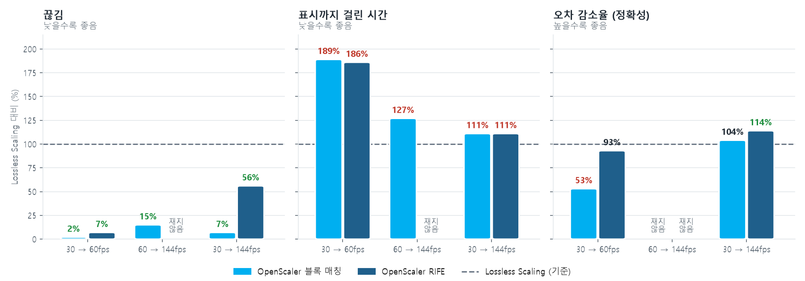

**표 읽는 법**

- Lossless Scaling과 같은 조건으로 번갈아 잰 항목은 **Lossless Scaling을 100%로 둔 상댓값 (실제 수치)** 으로 적습니다. 범위로 잰 값은 가운데 값끼리 나눴습니다.
- 높을수록 좋은 항목: 화면에 표시된 장면, 오차 감소율. 낮을수록 좋은 항목: 끊김, 표시까지 걸린 시간, 남은 오차.
- 남은 오차는 PSNR(dB)을 평균 제곱 오차로 바꿔 나눈 값입니다. 3dB 높으면 50%, 3dB 낮으면 200%입니다.
- 시간 고르기, 멈춤, 건너뜀, 추가 지연은 OpenScaler의 자체 기록(`--fg-log`)으로만 잴 수 있어 Lossless Scaling 값이 없습니다.
- 등급(좋음, 보통, 아쉬움, 나쁨)은 6.1의 기준입니다.

#### 6.2.1 마인크래프트 (일반 게임)

854×480 창, 시점을 계속 돌리며 쟀습니다. 게임 fps는 마인크래프트의 최대 프레임률 설정으로 맞췄습니다.

**30fps → 60fps**

정확성 (Lossless Scaling 고정 2배와 비교, 녹화 화면 왼쪽 위 640×340):

| 방식 | 오차 감소율 | 남은 오차 | 등급 |
|---|---|---|---|
| Lossless Scaling (기준) | 100% (87%) | 100% (35.6dB) | **좋음** |
| **OpenScaler 블록 매칭** | 53% (46%) | 398% (29.6dB) | 아쉬움 |
| **OpenScaler RIFE** | 93% (81%) | 138% (34.2dB) | **보통** |
| 단순 섞기 | 38% (33%) | 513% (28.5dB) | 나쁨 |
| 멈춤 (생성 없음) | 0% (0%) | 759% (26.8dB) | - |

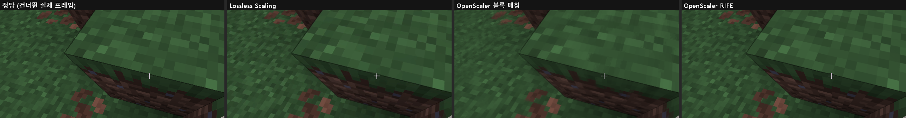

- 화면 전체가 움직여 Lossless Scaling이 가장 정확했고 OpenScaler RIFE가 그다음입니다. 블록 매칭은 잔디와 블록 질감을 흐리게 섞었습니다.
- 다른 녹화(화면 전체 비교, Lossless Scaling 없이)로 잰 OpenScaler 단독 결과는 블록 매칭 61% 아쉬움, RIFE 76% 보통이었습니다.

즉각성 (60Hz 모니터, Lossless Scaling 고정 2배와 번갈아 세 번, 20초씩, 1.5.3):

| 프로그램, 설정 | 화면에 표시된 장면 | 끊김 | Present부터 표시까지 |
|---|---|---|---|
| Lossless Scaling, 고정 2배 (기준) | 100% (초당 58.1\~58.5장) | 100% (분당 87\~110번) | 100% (5.9\~10.7ms) |
| **OpenScaler, 블록 매칭 보간** | 103% (초당 59.9\~60.0장) | 2% (분당 0\~3.3번) | 189% (15.7ms) |
| **OpenScaler, RIFE 보간** | 103% (초당 59.8\~59.9장) | 7% (분당 3.3\~10번) | 186% (15.4\~15.5ms) |

- OpenScaler는 거의 모든 화면에 새 장면을 냈고, Lossless Scaling은 초당 1.5장쯤 놓쳐 분당 100번 안팎 끊겼습니다.
- 화면에 나오기까지는 OpenScaler가 한 칸(15.7ms)으로 Lossless Scaling보다 5\~10ms 늦었습니다. 둘 다 Windows 화면 합성을 건너뛰는 하드웨어 독립 플립으로 표시됐고, Lossless Scaling은 수직 동기화를 기다리지 않고 바로 내서 더 빠릅니다.
- 다른 프로그램을 끄고 Lossless Scaling만 보통 권한으로 켜 둔 채 쟀습니다 (마인크래프트 렌더 거리 8). 처음 잰 날에는 관리자 권한 OBS와 Wallpaper Engine 등이 함께 떠 있었고, 그때는 OpenScaler의 화면이 모두 화면 합성을 거쳐 표시까지 32\~49ms가 걸렸습니다.

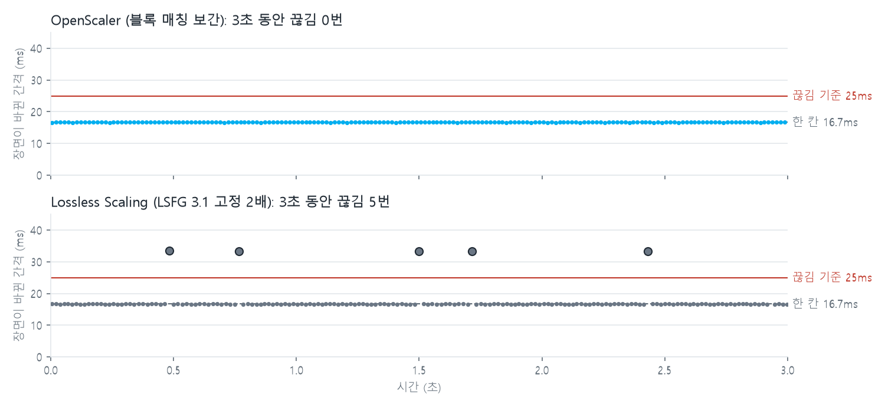

> 위 표의 PresentMon 기록(두 번째 실행)에서, 끊김 수가 그 실행의 평균에 가장 가까운 3초를 골랐습니다. 점이 한 칸(16.7ms)에 모여 있으면 고르게 나온 것이고, 끊김 기준(25ms) 위의 큰 점은 장면이 한 칸 늦게 바뀐 끊김입니다. 같은 3초에 OpenScaler는 0번, Lossless Scaling은 5번 끊겼습니다.

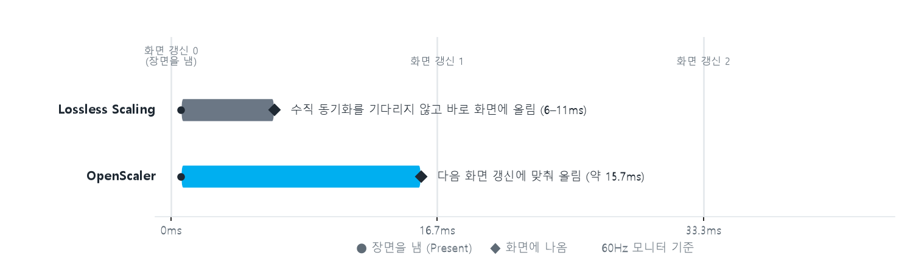

> 장면을 낸 순간(●)부터 화면에 나올 때(◆)까지를 60Hz 기준으로 그린 개념도입니다. OpenScaler는 수직 동기화로 다음 화면 갱신에 맞춰 올려 한 칸쯤 걸리고, Lossless Scaling은 기다리지 않고 바로 올려 더 빠릅니다. 다른 프로그램 때문에 Windows 화면 합성을 거치면 한 칸이 더 붙습니다.

OpenScaler 방식별 세부 (60Hz, 자체 기록, 방식마다 세 번, 1.5.3):

| 방식 | 출력 | 끊김 | 시간 고르기 | 멈춤 | 건너뜀 | 추가 지연 | RIFE 제때 |
|---|---|---|---|---|---|---|---|
| 블록 매칭 보간 | 100% 좋음 | 분당 0번 좋음 | 0.01\~0.04칸 좋음 | 0% 좋음 | 분당 0번 좋음 | 2.4\~2.9ms 좋음 | - |
| 블록 매칭 외삽 | 100% 좋음 | 분당 0번 좋음 | 0.03칸 좋음 | 0% 좋음 | 분당 0번 좋음 | 0ms (늦추지 않음) | - |
| RIFE 보간 | 100% 좋음 | 분당 0\~16번 좋음\~나쁨 | 0.22\~0.25칸 좋음 | 0% 좋음 | 분당 0번 좋음 | 23\~29ms 보통\~나쁨 | 93\~100% 보통\~좋음 |

- 블록 매칭은 모든 항목이 좋음이었습니다. RIFE는 결과를 기다리느라 화면을 늦춰 보여 주므로 추가 지연이 크고, 끊김은 실행마다 0\~16번으로 달랐습니다.
- 시험한 노트북은 GPU가 89°C에 이르면 클럭을 낮춰, 실행마다 식힌 뒤 쟀습니다. RIFE는 다른 프로그램을 끄고 마인크래프트 렌더 거리를 8로 줄인 상태에서 쟀습니다 (블록 매칭은 32).

**60fps → 144fps**

즉각성 (144Hz 모니터, Lossless Scaling과 번갈아 설정마다 두 번, 20초씩, 1.3.10):

| 프로그램, 설정 | 화면에 표시된 장면 | 끊김 | Present부터 표시까지 |
|---|---|---|---|
| Lossless Scaling, 적응형(목표 144), 흐름 배율 100 (기준) | 100% (초당 137.7\~140.4장) | 100% (분당 216번) | 100% (10\~16ms) |
| **OpenScaler, 블록 매칭 보간, 배수 자동** | 103% (초당 143.3\~143.4장) | 15% (분당 33번) | 127% (13\~20ms) |
| Lossless Scaling, 위 + 성능 우선 | 102% (초당 141.4\~141.8장) | 66% (분당 133\~150번) | 104% (10\~17ms) |
| Lossless Scaling, 적응형, 흐름 배율 50 | 102% (초당 142.1\~142.2장) | 47% (분당 97\~107번) | 96% (9\~16ms) |
| Lossless Scaling, 고정 2배 | 103% (초당 143.4\~143.5장) | 15% (분당 30\~33번) | 131% (17ms) |

- 적응형(주사율까지 채우기)끼리 비교하면 OpenScaler의 끊김이 Lossless Scaling 설정에 따라 3\~7배 적었습니다. Lossless Scaling은 가벼운 설정일수록 끊김이 줄었습니다.
- 고정 2배는 끊김이 비슷했지만, 60fps를 2배로 만들면 초당 120장이라 144Hz에서는 일부 장면이 두 번 나와 움직임이 고르지 않습니다. 이 측정은 장면이 바뀌었는지만 보므로 그 차이는 숫자에 드러나지 않습니다.
- GPU가 바쁠 때(다른 창에서 DJMAX가 곡을 재생하던 때) 같은 기본 설정끼리는 화면에 표시된 장면 123% (OpenScaler 초당 138\~143장, Lossless Scaling 101\~128장), 끊김 4% (분당 27\~110번, 909\~2,541번)였습니다.

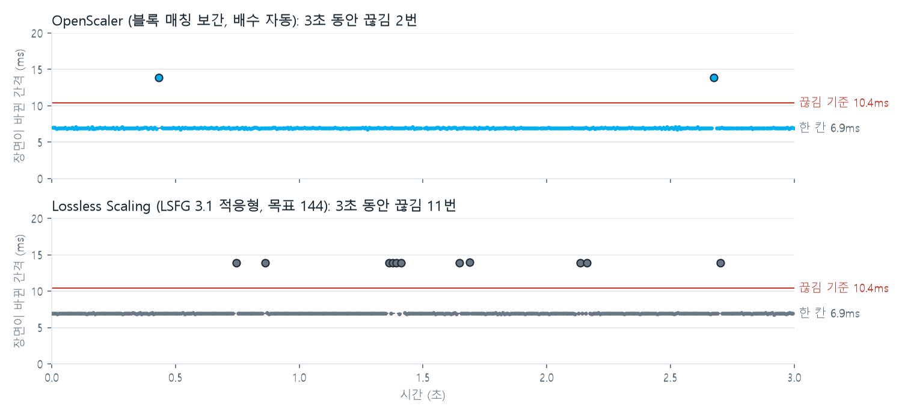

> 위 표의 PresentMon 기록(두 번째 실행)에서, 끊김 수가 그 실행의 평균에 가장 가까운 3초를 골라 화면에 새 장면이 바뀐 간격을 시간 순서대로 찍었습니다. 점이 한 칸(6.9ms)에 모여 있으면 고르게 나온 것이고, 끊김 기준(10.4ms) 위의 큰 점은 장면이 한 칸 늦게 바뀐 끊김입니다. 같은 3초에 OpenScaler는 2번, Lossless Scaling은 11번 끊겼습니다.

OpenScaler 방식별 세부 (144Hz, 자체 기록. 끊김만 화면 기준이며 위 표와 다른 실행입니다):

| 방식 | 출력 | 끊김 (화면 기준) | 시간 고르기 | 멈춤 | 건너뜀 | 추가 지연 | RIFE 제때 |
|---|---|---|---|---|---|---|---|
| 블록 매칭 보간 | 99\~100% 좋음 | 분당 20\~37번 나쁨 | 0.11\~0.12칸 좋음 | 0\~0.1% 좋음 | 분당 0\~4번 좋음\~보통 | 2.1\~2.5ms 좋음 | - |
| 블록 매칭 + 영역 | 100% 좋음 | 분당 13번 나쁨 | 0.12\~0.15칸 좋음 | 0% 좋음 | 분당 0\~5번 좋음\~보통 | 2.1\~2.7ms 좋음 | - |
| 블록 매칭 외삽 | 100% 좋음 | 분당 23번 나쁨 | 0.26\~0.71칸 보통\~나쁨 | 0.6\~2.7% 좋음\~보통 | 분당 95\~204번 나쁨 | 0ms (늦추지 않음) | - |
| RIFE + 영역 | 98% 보통\~좋음 | 분당 363\~400번 나쁨 | 0.52\~0.59칸 나쁨 | 5.5\~6.6% 나쁨 | 분당 428\~520번 나쁨 | 14\~15ms 보통 | 77\~84% 나쁨\~보통 |

- 정확성은 이 간격에서 재지 않았습니다.
- RIFE는 결과를 제때 쓴 비율이 영역을 지정해도 77\~84%라 60fps 게임을 실시간으로 따라가지 못했습니다 ([8. 알려진 한계](#8-알려진-한계)).

**30fps → 144fps**

정확성 (144fps로 1초 녹화해 정답으로 두고, 5장마다 하나씩 28.8fps로 보여 준 창을 5배로 채움. Lossless Scaling 고정 5배, OpenScaler 슬로모션 테스트, 1.4.3):

| 방식 | 오차 감소율 | 남은 오차 | 등급 |
|---|---|---|---|
| Lossless Scaling (기준) | 100% (51%) | 100% (26.8dB) | 아쉬움 |
| **OpenScaler 블록 매칭** | 104% (53%) | 93% (27.1dB) | 아쉬움 |
| **OpenScaler RIFE** | 114% (58%) | 85% (27.5dB) | 아쉬움 |
| 단순 섞기 | 79% (38\~43%) | 120% (25.8\~26.2dB) | 나쁨 |
| 멈춤 (생성 없음) | 0% (0%) | 202% (23.7\~23.8dB) | - |

- 세 방식 모두 "아쉬움"이었고 차이가 작았습니다. 사이에 채울 장면이 많고 움직임이 커서, 60fps로 채울 때보다 모두 정확도가 낮았습니다.
- 이번에는 Lossless Scaling의 출력 2560×1440을 1/3로 줄여 원본과 비교해 녹화 손실이 32.8dB로 컸습니다. 그 손실을 빼고 계산하면 Lossless Scaling의 오차 감소율은 58%라, OpenScaler 블록 매칭은 91%, RIFE는 100%가 됩니다.
- 정답을 녹화할 때 게임이 144fps를 꾸준히 내지 못해 빠진 칸이 있었고, 정답이 있는 칸만 비교했습니다 (방식마다 생성 프레임 141\~353장). 장면 하나, 시점을 돌리는 속도 하나로 잰 결과입니다.

즉각성 (144Hz 모니터, 기본 설정끼리 번갈아 세 번, 배수 4.8, 1.4.3):

| 프로그램, 설정 | 화면에 표시된 장면 | 끊김 | Present부터 표시까지 |
|---|---|---|---|
| Lossless Scaling, 적응형(목표 144) (기준) | 100% (초당 106.6\~108.0장) | 100% (분당 1,792\~1,988번) | 100% (17\~19ms) |
| **OpenScaler, 블록 매칭 보간** | 132% (초당 140.9\~142.3장) | 7% (분당 100\~180번) | 111% (20ms) |
| **OpenScaler, RIFE 보간** | 117% (초당 125.3\~126.5장) | 56% (분당 1,022\~1,086번) | 111% (20ms) |

- 게임 프레임 사이에 채울 장면이 많아지자 Lossless Scaling은 화면에 초당 107장 정도만 표시해, 60fps 게임일 때보다 끊김이 훨씬 많았습니다.

OpenScaler 방식별 세부 (144Hz, 자체 기록. 끊김만 화면 기준이며 위 표와 다른 실행(1.3.10)입니다):

| 방식 | 출력 | 끊김 (화면 기준) | 시간 고르기 | 멈춤 | 건너뜀 | 추가 지연 | RIFE 제때 |
|---|---|---|---|---|---|---|---|
| 블록 매칭 보간 | 100% 좋음 | 분당 30번 나쁨 | 0.35칸 보통 | 0.8% 좋음 | 분당 11번 나쁨 | 3.6ms 좋음 | - |
| 블록 매칭 + 영역 | 100% 좋음 | 분당 13\~17번 나쁨 | 0.10\~1.19칸 좋음\~나쁨 | 0.1\~5% 좋음\~보통 | 분당 11\~31번 나쁨 | 2.0\~3.9ms 좋음 | - |
| 블록 매칭 외삽 | 99\~100% 좋음 | 분당 23\~27번 나쁨 | 0.35\~0.66칸 보통\~나쁨 | 0.7\~1.5% 좋음\~보통 | 분당 15\~50번 나쁨 | 0ms (늦추지 않음) | - |
| RIFE + 영역 | 94% 보통 | 분당 600번 나쁨 | 0.34칸 보통 | 0.8% 좋음 | 분당 25번 나쁨 | 25ms 나쁨 | 100% 좋음 |

- RIFE는 30fps 게임에서는 결과를 100% 제때 썼지만, 화면마다 GPU 시간이 길어(90%가 6ms, 한 칸 6.9ms) 화면을 자주 늦게 냈습니다.

#### 6.2.2 DJMAX RESPECT V (리듬게임)

DJMAX는 노트가 내려오는 건반만 움직이고 나머지는 고정된 UI인 화면이라, 주로 **프레임 생성 영역 지정과 영역 추천이 제대로 동작하는지** 확인하는 데 썼습니다. 영역 추천은 이 게임에서 건반 부분을 찾아냈고, 영역을 건반으로 좁히면 움직임을 찾고 합성할 부분이 그만큼 줄어듭니다 (3.2 사용법의 영역 지정 그림이 이 게임 화면입니다). 성능은 **30fps → 60fps**만 60Hz 모니터에서 Lossless Scaling과 비교했습니다. 게임이 60fps로 돌아가서, 30fps 조건은 곡을 플레이하며 60fps로 녹화한 화면을 한 장씩 건너뛰어 만들었습니다.

**한눈에 보기** (DJMAX, 30fps → 60fps)

- **정확성은 OpenScaler가 조금 나았습니다.** 오차 감소율이 블록 매칭 106%, RIFE 105%로 Lossless Scaling보다 조금 높았고 셋 다 좋음입니다. 다만 블록 매칭은 글자와 노트 가장자리에 칸 모양 깨짐이 보였고, 눈으로는 RIFE가 가장 깨끗했습니다.
- **끊김은 OpenScaler가 적었지만 둘 다 거의 끊기지 않았습니다.** 노트가 일정하게 내려오는 화면이라 Lossless Scaling도 분당 3\~13번에 그쳤고, OpenScaler는 그 40\~80%였습니다.
- **화면에 나오기까지는 Lossless Scaling이 빨랐습니다.** OpenScaler 15ms, Lossless Scaling 8.5ms로 마인크래프트와 같은 경향입니다.

**요약 표** (Lossless Scaling = 100%. 색 기준은 위 마인크래프트 요약과 같음)

| 간격 | 끊김<br>블록 매칭 | 끊김<br>RIFE | 표시까지 걸린 시간<br>블록 매칭 | 표시까지 걸린 시간<br>RIFE | 오차 감소율<br>블록 매칭 | 오차 감소율<br>RIFE |
|---|---|---|---|---|---|---|
| | *낮을수록 좋음* | *낮을수록 좋음* | *낮을수록 좋음* | *낮을수록 좋음* | *높을수록 좋음* | *높을수록 좋음* |
| 30fps → 60fps | $`\color{green}{\mathsf{40\%}}`$ | $`\color{green}{\mathsf{80\%}}`$ | $`\color{red}{\mathsf{183\%}}`$ | $`\color{red}{\mathsf{180\%}}`$ | 106% | 105% |

정확성 (Lossless Scaling 고정 2배와 비교, 녹화 화면 왼쪽 위 960×510):

| 방식 | 오차 감소율 | 남은 오차 | 등급 |
|---|---|---|---|
| Lossless Scaling (기준) | 100% (85%) | 100% (28.6dB) | **좋음** |
| **OpenScaler 블록 매칭** | 106% (90%) | 60% (30.8dB) | **좋음** |
| **OpenScaler RIFE** | 105% (89%) | 72% (30.0dB) | **좋음** |
| 단순 섞기 | 47% (40%) | 398% (22.6dB) | 나쁨 |
| 멈춤 (생성 없음) | 0% (0%) | 661% (20.4dB) | - |

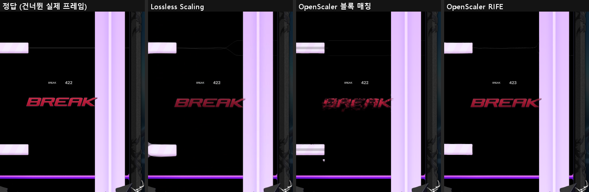

- 노트처럼 단순한 움직임에서는 OpenScaler의 오차가 조금 작았지만, 블록 매칭은 "BREAK" 같은 글자와 노트 가장자리에 칸 모양 깨짐이 보였습니다. Lossless Scaling은 노트 가장자리가 조금 휘었고, RIFE가 가장 깨끗했습니다.
- 다른 녹화(화면 전체 비교, Lossless Scaling 없이)로 잰 OpenScaler 단독 결과는 블록 매칭 87%, RIFE 90%로 모두 좋음이었습니다.

즉각성 (60Hz 모니터, 녹화 화면을 30fps로 재생한 창, Lossless Scaling 고정 2배와 번갈아 세 번, 20초씩, 1.5.3):

| 프로그램, 설정 | 화면에 표시된 장면 | 끊김 | Present부터 표시까지 |
|---|---|---|---|
| Lossless Scaling, 고정 2배 (기준) | 100% (초당 59.8\~60.0장) | 100% (분당 3.3\~13.3번) | 100% (8.4\~8.7ms) |
| **OpenScaler, 블록 매칭 보간** | 100% (초당 60.0장) | 40% (분당 3.3번) | 183% (15.7ms) |
| **OpenScaler, RIFE 보간** | 100% (초당 59.8\~60.0장) | 80% (분당 3.3\~10번) | 180% (14.9\~15.9ms) |

- 두 프로그램 모두 거의 끊기지 않았고, OpenScaler는 화면에 나오기까지 한 칸(15ms)으로 Lossless Scaling보다 7ms쯤 늦었습니다. 둘 다 하드웨어 독립 플립으로 표시됐고, Lossless Scaling은 수직 동기화를 기다리지 않고 바로 내서 더 빠릅니다. 재생 창을 주 모니터와 보조 모니터에 띄워도 같았습니다.
- RIFE 줄은 DJMAX를 끄고 재생 창만 띄워 주 모니터와 보조 모니터에서 두 번씩 잰 값입니다 (Lossless Scaling 줄과는 다른 시각의 측정).

OpenScaler 방식별 세부 (같은 창, 60Hz, 자체 기록, 1.5.3):

| 방식 | 출력 | 끊김 | 시간 고르기 | 멈춤 | 건너뜀 | 추가 지연 | RIFE 제때 |
|---|---|---|---|---|---|---|---|
| 블록 매칭 보간 (여섯 번) | 100% 좋음 | 분당 0\~4번 좋음\~보통 | 0.01\~0.14칸 좋음 | 0% 좋음 | 분당 0\~4번 좋음\~보통 | 1.6\~2.9ms 좋음 | - |
| RIFE 보간 (세 번) | 99\~100% 좋음 | 분당 4\~11번 보통\~나쁨 | 0.33\~0.41칸 보통 | 0\~0.1% 좋음 | 분당 0\~7번 좋음\~나쁨 | 29\~32ms 나쁨 | 96\~100% 좋음 |

- RIFE는 결과를 거의 모두 제때 썼지만, 결과를 기다리느라 화면을 30ms쯤 더 늦춰 보여 줍니다. 노트처럼 단순한 움직임에서는 블록 매칭이 더 고르고 빨랐습니다.

#### 6.2.3 측정 조건과 참고

- **144Hz 측정**: 2560×1440 144Hz 주 모니터, NVIDIA 전원 관리 "최대 성능 선호". 끊김은 [PresentMon](https://github.com/GameTechDev/PresentMon) 2.6.0으로 화면에 실제로 나간 장면을 기록해, 다음 장면이 1.5칸(10.4ms) 넘게 늦게 바뀐 횟수를 셌습니다. 마인크래프트는 매번 첫 실행이 시작 직후 GPU 시간이 튀어 끊김이 분당 116\~127번이라 각 묶음의 첫 실행을 뺐습니다.
- 요약하면 144Hz에서 출력과 추가 지연은 **좋음**이지만, 화면 기준 끊김은 모든 경우 **나쁨**입니다. 144Hz에서는 **블록 매칭 보간 + 영역 + 배수 자동**을 권합니다.
- **화면 기준 끊김은 자체 기록보다 1.5\~2배 많습니다.** 끊김의 절반쯤은 OpenScaler가 화면을 제때 냈는데 GPU 작업이 늦게 끝나(게임과 GPU를 나눠 쓰는 순간), Windows 화면 합성(DWM)이 한 칸 뒤에 표시한 경우입니다. 확대 화면 창은 클릭을 게임으로 통과시키기 위해 레이어드 창이지만, 60Hz 측정에서는 대개 합성을 건너뛰는 하드웨어 독립 플립으로 표시됐습니다. 관리자 권한 OBS와 Wallpaper Engine 등이 함께 떠 있던 한 번의 측정에서만 합성을 거쳤고, Lossless Scaling이나 보통 권한 OBS를 켜 두기만 한 것으로는 합성되지 않았습니다.
- "Present부터 표시까지"는 프로그램이 장면을 낸 뒤 화면에 나오기까지의 시간이며 입력 지연 전체가 아닙니다. 두 프로그램 모두 보간이므로 게임 프레임 한 장만큼 더 늦어집니다. OpenScaler는 화면을 내는 시점이 합성 주기의 어디에 걸리느냐에 따라 실행마다 13ms나 20ms로 한 칸 차이가 납니다.
- **고주사율 모니터를 주 모니터로 두어야 합니다.** Windows 10은 화면 합성을 주 모니터의 주사율로 해서, 주 모니터가 60Hz면 144Hz 모니터에서도 확대 화면이 초당 60장에 묶입니다 (게임 60fps와 같아져 프레임 생성이 쉽니다).
- **NVIDIA 그래픽카드는 OpenScaler의 전원 관리 모드를 "최대 성능 선호"로 두는 것을 권합니다** (NVIDIA 제어판 → 3D 설정 관리 → 프로그램 설정). 기본값에서는 GPU 사용률이 50\~60%라 드라이버가 클럭을 낮춰, 마인크래프트를 띄운 채 확대만 해도(프레임 생성 끔) 출력이 초당 124\~130장이었습니다. 바꾼 뒤에는 144장, 프레임 생성을 켜면 142\~143장입니다.
- **확대 중에는 OpenScaler의 GPU 스케줄링 우선순위를 "실시간"으로 올립니다** (1.3.10, RIFE를 쓸 때는 보통). GPU를 많이 쓰는 게임(수직 동기화를 끈 마인크래프트, GPU 사용률 84%)에서는 게임 fps가 165에서 155\~159로 4\~6% 줄었지만, 확대 화면의 끊김은 분당 1600\~2100번에서 240\~290번으로 줄었습니다. RIFE의 우선순위는 높여도 끊김이 줄지 않았고, 실시간으로 올리면 게임 화면이 빠지기 시작해 보통으로 둡니다 (같은 게임에서 RIFE를 실시간으로 하면 끊김이 분당 1900\~2000번에서 340\~360번으로 줄었지만 게임 fps가 7% 줄었습니다).
- 배수를 2배로 고정하면 144Hz를 60fps로 고르게 나눌 수 없어 같은 장면이 두 번 나오는 비율이 18\~20%입니다. 고주사율에서는 배수를 **자동**(주사율까지 채우기)으로 두세요.
- 60Hz 모니터에서는 게임이 52fps를 넘으면 넣을 자리가 없어 프레임 생성이 쉽니다.
- RIFE는 신경망 결과를 기다리느라 화면을 놓치지 않도록, 결과가 나오기까지 걸린 시간만큼 화면을 늦춰 보여 줍니다. 그래서 끊김과 건너뜀은 적지만 추가 지연이 큽니다. 60Hz에서 데모 창(21fps)으로 세 번 잰 중앙값은 출력 98%, 끊김 분당 0번, 시간 고르기 0.29칸, 추가 지연 44.1ms, 제때 쓴 비율 100%였습니다. RIFE는 시험한 PC(GTX 1060)에서 144Hz를 따라가지 못했습니다 ([8. 알려진 한계](#8-알려진-한계)).
- **정확성 측정**: Lossless Scaling은 확대한 화면을 OBS 게임 캡처로 녹화해 장면을 꺼냈습니다. 화면 캡처는 Lossless Scaling이 막으므로, 두 프로그램을 모두 관리자 권한으로 실행했습니다. 60fps로 채울 때 녹화 과정의 손실은 실제 프레임에서 42\~44dB로 작습니다. OpenScaler는 같은 창으로 슬로모션 테스트를 돌려 실시간과 같은 셰이더로 만든 중간 프레임을 그대로 저장했습니다. 비교 영역에서 Lossless Scaling의 FPS 표시가 있는 위쪽 줄은 뺐습니다. 게임마다 2초(약 120장)를 반복한 원본 하나로 잰 결과입니다.
- 게임이 더 느리면 프레임 사이 간격이 벌어져 등급이 내려갑니다. 15fps 게임과 같은 간격에서는 블록 매칭 59\~73%, RIFE 75\~81%였습니다 (마인크래프트, DJMAX).
- 측정은 이 PC 한 대에서 했고, 실제로 플레이하며 느끼는 차이는 확인하지 못했습니다. 분석 스크립트는 `tools/test/pmcompare.py`, `fgtiming.py`, `fgquality.py`입니다.

---

## 7. 동작 원리

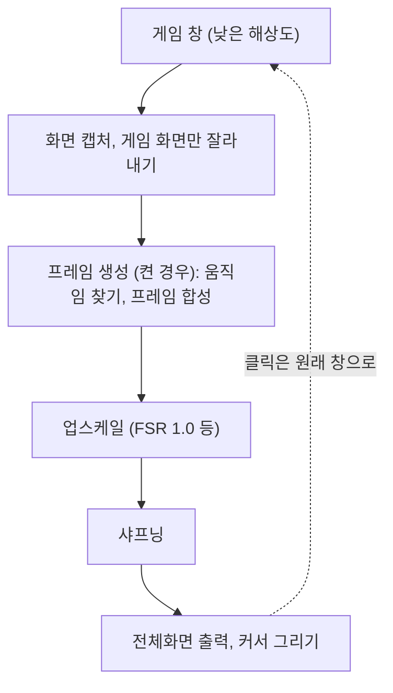
```mermaid
flowchart TD
    A["게임 창 (낮은 해상도)"] --> B["화면 캡처, 게임 화면만 잘라내기"]
    B --> D["프레임 생성 (켠 경우): 움직임 찾기, 프레임 합성"]
    D --> E["업스케일 (FSR 1.0 등)"]
    E --> F["샤프닝"]
    F --> G["전체화면 출력, 커서 그리기"]
    G -. 클릭은 원래 창으로 .-> A
```

| 단계 | 쓰는 기술 | 하는 일 |
|---|---|---|
| 캡처 | Windows.Graphics.Capture | 대상 창의 화면을 GPU 텍스처로 받습니다. CPU로 복사하지 않아 빠릅니다 |
| 잘라내기 | Direct3D 11 | 창 테두리와 제목 표시줄을 빼고 게임 화면(클라이언트 영역)만 복사합니다 |
| 프레임 생성 | 컴퓨트 셰이더, RIFE(DirectML) | 원본 해상도에서 움직임을 찾고 새 프레임을 합성합니다. 확대 전에 하므로 계산량이 적습니다 |
| 업스케일 | 픽셀 셰이더 | 선택한 알고리즘으로 모니터 크기에 맞게 확대합니다 |
| 샤프닝 | 픽셀 셰이더 | 확대하면서 흐려진 윤곽선을 선명하게 만듭니다 |
| 출력 | 클릭이 통과하는 최상위 창 | 사용자는 확대된 화면을 보고, 입력은 게임으로 그대로 전달됩니다 |

### 7.1 마우스 좌표 변환

확대 화면은 클릭이 통과하는 창이라, 클릭은 항상 **실제 커서 위치** 아래의 창으로 들어갑니다.
그래서 실제 커서는 원래 창 안의 대응 위치에 두고, 사용자에게는 확대된 위치에 커서를 따로 그려 보여 줍니다.

1. 게임 창이 활성 상태에서 커서가 확대 화면 위로 들어오면, 실제 커서를 원래 창의 대응 위치로 옮깁니다.
2. 시스템 커서는 숨기고(Magnification API), 지금 커서 모양을 텍스처로 바꿔 확대된 위치에 그립니다.
3. 실제 커서가 원래 창 밖으로 나가면, 확대 화면의 같은 가장자리 바로 바깥으로 커서를 내보냅니다.
4. 다른 창으로 바꾸거나 확대를 끄면 커서를 화면상 보이던 위치로 되돌립니다.

### 7.2 프레임 생성

- **블록 매칭**: 원본을 여러 단계로 줄인 영상에서 큰 움직임부터 찾고, 단계를 올라가며 칸마다 움직임을 다듬습니다. 앞뒤 방향의 결과가 서로 맞는지 확인해 믿을 수 없는 칸은 덜 씁니다.
- **RIFE**: 게임 프레임 쌍마다 신경망을 따로 스레드에서 한 번 돌려 중간 시점의 움직임과 섞는 비율을 얻고, 합성은 원본 해상도에서 셰이더로 합니다. 신경망 입력을 줄여도 화면은 흐려지지 않습니다.
- **표시 시점**: 게임의 프레임 간격이 고르지 않아도 화면 속 시간이 일정하게 흐르도록, 최근 간격의 중앙값만큼 늦게 가는 표시 시계에 맞춰 생성할 시점을 정합니다.
- **게임별 학습**: 확대 중 가끔 게임 프레임 하나를 가리고 양옆으로 다시 만들어 정답과 비교합니다. 칸 크기, 탐색 범위 같은 값을 하나씩 바꿔 보며 점수가 오르면 채택하고, 기본값과도 주기적으로 비교해 나빠지지 않게 합니다.

### 7.3 FSR 1.0 구현

- 알고리즘 본체는 AMD 공식 헤더(`third_party/fsr`, MIT 라이선스)를 수정 없이 사용합니다.
- `src/fsr.hlsl`에서 입력 텍스처를 읽는 콜백과 픽셀 셰이더 진입점만 정의하고, 빌드할 때 `fxc`로 미리 컴파일합니다.
- 업스케일 단계는 EASU, 샤프닝 단계는 RCAS로 바뀌며, 샤프닝 강도(0\~1)는 RCAS의 단계(stop) 값으로 변환합니다.

---

## 8. 알려진 한계

겪을 때 바로 할 수 있는 조치는 [3.7 문제 해결](#37-문제-해결)에 모았습니다.

- 전용 전체화면(Exclusive Fullscreen) 게임은 캡처할 수 없습니다. 게임을 창 모드로 실행해야 합니다.
- 화면을 한 번 더 그리는 구조라 약간의 입력 지연이 생깁니다. 프레임 생성의 보간은 여기에 게임 프레임 한 장 간격(30fps 게임이면 약 33ms)과 계산 시간이 더해지고, RIFE는 신경망 시간만큼 더 늦어집니다.
- 게임 fps가 모니터 주사율에 가까우면(주사율의 87% 이상) 프레임을 넣을 자리가 없어 게임 프레임만 보여 줍니다. 캡처도 모니터 주사율을 넘지 못합니다.
- Windows 10에서 주사율이 다른 모니터를 함께 쓰면 확대 화면은 주 모니터의 주사율로 나옵니다. 고주사율 모니터를 주 모니터로 두세요.
- 고주사율(144Hz)에서는 화면마다 계산할 시간이 6.9ms뿐이라, 그래픽카드가 게임과 함께 감당하지 못하면 가끔 화면이 한 칸 늦게 나옵니다. NVIDIA 그래픽카드는 전원 관리 모드를 "최대 성능 선호"로 두면 크게 줄어듭니다 ([6.2](#62-성능-평가)).
- RIFE 보간은 시험한 PC(GTX 1060)에서 144Hz를 따라가지 못해 화면이 자주 한 칸 늦게 나왔습니다 (분당 360\~600번). 신경망이 GPU를 길게 쓰는 동안 같은 프로그램의 화면 그리기가 그 뒤에서 기다리기 때문입니다. GPU 우선순위를 바꾸는 것으로는 풀리지 않았고, 신경망 시간이 짧은 더 빠른 그래픽카드가 필요한 실행 환경의 한계로 봅니다. 이 PC의 144Hz에서는 블록 매칭 보간을 쓰세요. 60Hz의 데모 창 측정에서는 RIFE도 끊기지 않았습니다.
- 프레임 생성은 게임의 움직임 정보 없이 화면만 보므로 빠른 움직임, 화면 가장자리, 생김새가 같은 물체(리듬게임 노트 등), 제자리에서 밝기만 변하는 글자에서 깨질 수 있습니다.
- 게임 창이 모니터보다 커서 화면 밖으로 나간 부분은 Windows가 그리지 않으므로 잘라내고 보이는 부분만 확대합니다.
- 확대 중에는 실제 커서가 원래 창 크기 안에서 움직여 화면상 커서가 빨라집니다. 커서 속도 보정을 켜도 Windows 속도가 1\~20 단계라 배율이 정확히 맞지 않을 수 있습니다. 바꾼 속도는 레지스트리에 저장하지 않고, 비정상 종료되면 다음 실행 때 되돌립니다.
- 게임 창과 확대 화면 사이에 다른 창이 겹쳐 있으면 클릭이 그 창으로 갈 수 있습니다.
- Windows 10에서는 캡처 중인 창에 노란 테두리가 표시될 수 있습니다 (Windows 11에서는 숨김).

---

## 9. 개발과 기여

버그 제보, 기능 제안, 다른 기기에서 잰 결과, 코드 수정 모두 환영합니다. 이슈와 PR을 올리는 방법, 확인할 것, 코드와 문서 규칙은 [CONTRIBUTING.md](CONTRIBUTING.md)에 정리했습니다.

### 9.1 직접 빌드하기

필요한 것: Visual Studio 2022 이상 ("C++를 사용한 데스크톱 개발" 워크로드), Windows 10 SDK, CMake

`x64 Native Tools Command Prompt for VS`를 열고:

```
git clone https://github.com/kojunpyo/OpenScaler.git
cd OpenScaler
cmake -S . -B build -G Ninja -DCMAKE_BUILD_TYPE=Release
cmake --build build
```

빌드 결과는 `build/OpenScaler.exe`입니다. 프로젝트 폴더 경로가 아주 길면 MSVC 빌드가 실패할 수 있으니 짧은 경로(예: `C:\dev\OpenScaler`)에 두는 것을 권장합니다.

RIFE를 쓰려면 `rife` 폴더를 `OpenScaler.exe` 옆에 직접 만들어야 합니다. 자동 빌드(`.github/workflows/build.yml`)도 같은 방법으로 만듭니다.

| 파일 | 얻는 곳 |
|---|---|
| `onnxruntime.dll`, `onnxruntime_providers_shared.dll` | NuGet `Microsoft.ML.OnnxRuntime.DirectML` 1.24.4의 `runtimes/win-x64/native` |
| `DirectML.dll` | NuGet `Microsoft.AI.DirectML` 1.15.4의 `bin/x64-win` |
| `rife.onnx` | [RIFE v4.26 모델](https://huggingface.co/hzwer/RIFE)의 `flownet.pkl`을 `python -I tools/rife_export.py flownet.pkl rife.onnx`로 변환 (torch, onnx, onnxscript 필요) |

`main`에 푸시하거나 PR을 올리면 GitHub Actions가 자동으로 빌드하고, `v`로 시작하는 태그를 푸시하면 빌드 결과가 GitHub Releases에 올라갑니다.

<details>
<summary>명령줄 옵션 (테스트용)</summary>

```
OpenScaler.exe --target "창 제목 일부" --mode 4 --sharp 0.5 --fg --duration 10
```

| 옵션 | 설명 |
|---|---|
| `--target` | 제목에 이 문자열이 들어간 창을 바로 확대 |
| `--mode` | 0: Nearest, 1: Bilinear, 2: Bicubic, 3: Lanczos2, 4: FSR 1.0 |
| `--sharp` | 샤프닝 강도 (0 \~ 1) |
| `--integer` | 정수배 스케일링 사용 |
| `--compare` | 비교 모드로 시작 |
| `--cursor-speed` | 커서 속도 보정 켜기 |
| `--fg` | 프레임 생성 켜기 |
| `--fg-mult` | 배수 (2\~4, 없으면 주사율까지 자동) |
| `--fg-quality` | 정밀도 (0: 낮음, 1: 기본, 2: 높음) |
| `--fg-block` | 방식을 블록 매칭 보간으로 (기본값) |
| `--fg-rife` | 방식을 RIFE 보간으로 |
| `--fg-extrapolate` | 방식을 블록 매칭 외삽으로 |
| `--fg-visualize` | 찾아낸 움직임을 색으로 표시 |
| `--fg-log` | 화면마다 표시 시점을 파일에 기록 |
| `--no-gpu-priority` | 확대 중에도 GPU 스케줄링 우선순위를 올리지 않음 (비교 측정용) |
| `--rife-gpu-priority 숫자` | RIFE를 쓸 때의 GPU 스케줄링 우선순위 (2 보통(기본값), 3 보통 이상, 4 높음, 5 실시간, 비교 측정용) |
| `--slowmo-auto` | `--target`으로 확대를 시작하고 지정한 초 뒤에 슬로모션 테스트 녹화 |
| `--slowmo-target` | 슬로모션 테스트에서 흉내 낼 주사율 (0이면 모니터 주사율, 기본값) |
| `--slowmo-seconds` | 슬로모션 테스트의 녹화 길이 (1\~3초) |
| `--slowmo-dump` | 슬로모션 테스트에서 만든 프레임을 지정한 폴더에 BMP로 저장 |
| `--fg-selftest` | 계산으로 만든 영상으로 프레임 생성 품질을 재서 지정한 폴더에 저장하고 종료 |
| `--rife-bench` | RIFE 신경망 시간을 입력 크기별로 재서 지정한 폴더에 저장하고 종료. 환경 변수 `OPENSCALER_RIFE_PROFILE`에 파일 이름 앞부분을 주면 ONNX Runtime 연산별 기록도 남김 |
| `--fg-gaptest` | `--slowmo-dump`로 저장한 게임 프레임을 2\~8칸 건너뛰어 생성하고, 건너뛴 게임 프레임과 비교해 두 번째 폴더에 저장하고 종료. 세 번째로 프로필(.json)을 주면 그 학습된 설정도 비교 |
| `--no-gui` | 설정 창 없이 실행 (단축키로만 조작) |
| `--console` | 로그를 보여 주는 콘솔 창 열기 |
| `--duration` | 지정한 초가 지나면 자동 종료 |

</details>

### 9.2 기술 스택

| 분류 | 사용 기술 |
|---|---|
| 언어 | C++20, HLSL |
| 그래픽스 | Direct3D 11, DXGI, Direct2D |
| 화면 캡처 | Windows.Graphics.Capture (C++/WinRT) |
| 신경망 | ONNX Runtime + DirectML (실행 중에 불러옴) |
| 설정 창 | Dear ImGui |
| 입력/창 처리 | Win32 API, Magnification API |
| 빌드 | CMake, MSVC (Visual Studio 2022 이상) |

### 9.3 프로젝트 구조

| 역할 | 파일 | 내용 |
|---|---|---|
| 뼈대 | [`src/main.cpp`](src/main.cpp) | 캡처, 확대 화면 창, 렌더링 순서, 커서 변환, 단축키, 설정 파일, 메인 루프 |
| | [`src/app.h`](src/app.h) | 메인 루프와 설정 창이 함께 쓰는 설정과 기능 |
| 화면 확대 | [`src/shaders.h`](src/shaders.h) | 업스케일, 샤프닝, 커서 셰이더 (실행 중에 컴파일) |
| | [`src/fsr.hlsl`](src/fsr.hlsl), [`src/fsr_constants.*`](src/fsr_constants.cpp) | FSR 1.0 셰이더 진입점 (빌드 때 fxc로 컴파일)과 상수 계산 |
| 프레임 생성 | [`src/framegen.*`](src/framegen.cpp) | 움직임 찾기, 합성, 표시 시점, 채점 |
| | [`src/framegen_shaders.h`](src/framegen_shaders.h) | 프레임 생성 컴퓨트 셰이더 (실행 중에 컴파일) |
| | [`src/rife.*`](src/rife.cpp) | RIFE 신경망 실행 (ONNX Runtime을 실행 중에 불러옴) |
| | [`src/game_profile.*`](src/game_profile.cpp) | 게임별 학습: 설정 자동 조정, 화면 지도, `profiles/*.json` 저장 |
| 설정 창 | [`src/gui.*`](src/gui.cpp) | Dear ImGui로 그린 설정 창 |
| 테스트 | [`src/framegen_test.*`](src/framegen_test.cpp) | 자체 테스트 (`--fg-selftest`, `--fg-gaptest`, `--rife-bench`) |
| | [`tools/test/`](tools/test) | 수동 테스트 스크립트 |
| 도구 | [`tools/make_icon.ps1`](tools/make_icon.ps1), [`tools/rife_export.py`](tools/rife_export.py) | 로고와 아이콘 생성, RIFE 모델을 ONNX로 변환 |
| 외부 코드 | [`third_party/`](third_party) | FSR 1.0 헤더, Dear ImGui 1.91.5, ONNX Runtime 헤더, Neo둥근모 Pro 글꼴 (모두 수정 없음) |
| 기타 | `assets/`, `docs/`, `.github/workflows/` | 로고와 아이콘, 스크린샷과 측정 기록, 자동 빌드와 배포 |

### 9.4 학습 데이터 올리기

잘 학습된 데이터([5.4](#54-학습-데이터-공유))는 [`shared-profiles`](shared-profiles) 폴더에 PR로 올립니다. GitHub 계정이 있으면 누구나 올릴 수 있습니다.

1. 저장소를 Fork하고, 내보낸 파일을 `shared-profiles/게임 이름.json`에 넣습니다. 파일 이름은 파일 안의 `name`과 같아야 합니다 (`\ / : * ? " < > |`는 `_`로 바꿈).
2. `python -I tools/profile_info.py "shared-profiles/게임 이름.json"`의 요약을 PR 본문에 붙입니다.
3. 게임 버전과 실행한 곳, 게임 창 크기, 프레임 생성 방식과 영역을 지정했는지, 어떤 장면을 몇 분 했는지 적어 주세요.

PR을 열면 GitHub Actions가 파일 형식을 검사합니다. **이미 있는 파일을 바꾸는 기준**은 같은 방식(보간 또는 외삽)의 "최근 채점 200회 평균, 기준보다 +dB"가 기존 파일보다 **0.2dB 넘게 높을 때**입니다. `python -I tools/profile_info.py "기존.json" "새 파일.json"`의 비교 결과를 붙여 주세요.

---

## 10. 로고와 글꼴


연한 하늘색(#A6DAF4) 배경 위의 하얀 행성 고리는 OpenScaler의 첫 글자 **O**를, 30도로 기울어진 진한 하늘색(#00AFF0) 선은 업스케일 전후의 경계를 뜻합니다. 선 왼쪽은 노이즈 낀 저해상도 이미지, 오른쪽은 선명한 이미지입니다. 로고와 exe 아이콘은 `tools/make_icon.ps1`로 만듭니다.

설정 창과 확대 화면 위 메뉴의 글꼴은 픽셀 글꼴 [Neo둥근모 Pro](https://neodgm.dalgona.dev/)(SIL OFL 1.1)입니다. 본문보다 설명과 상태처럼 덜 중요한 글을 더 작게 그리고, 화면 전체의 크기는 Windows 배율에 맞춥니다. 색은 로고와 같은 두 하늘색으로, 구역 테두리는 연한 하늘색, 제목과 주요 버튼 같은 중요한 글은 진한 하늘색입니다.

---

## 11. 참고 자료

- [Windows.Graphics.Capture 문서 (Microsoft)](https://learn.microsoft.com/windows/uwp/audio-video-camera/screen-capture)
- [AMD FidelityFX CAS / FSR (GPUOpen)](https://gpuopen.com/fidelityfx-superresolution/) - 샤프닝 아이디어
- [AMD FidelityFX FSR 1.0 소스](https://github.com/GPUOpen-Effects/FidelityFX-FSR) - `third_party/fsr`에 포함
- [Practical-RIFE](https://github.com/hzwer/Practical-RIFE) - RIFE 신경망 구조와 학습 모델
- [MJP, Catmull-Rom 9탭 샘플링](https://gist.github.com/TheRealMJP/c83b8c0f46b63f3a88a5986f4fa982b1) - Bicubic 모드의 셰이더 코드 (`src/shaders.h`에 옮김, MIT)
- [Magpie](https://github.com/Blinue/Magpie) - 같은 목적의 오픈소스 프로젝트. 구조 참고용으로만 살펴봤으며 코드는 가져오지 않았습니다.
- [Lossless Scaling](https://store.steampowered.com/app/993090/Lossless_Scaling/) - 기능 아이디어의 출처

---

## 12. 라이선스

이 프로젝트는 [MIT License](LICENSE)로 배포됩니다. 자유롭게 사용, 수정, 배포할 수 있습니다.

- `third_party/fsr`의 FSR 1.0 헤더는 AMD의 저작물이며 MIT 라이선스를 따릅니다 ([third_party/fsr/license.txt](third_party/fsr/license.txt)).
- `third_party/imgui`의 Dear ImGui는 Omar Cornut의 저작물이며 MIT 라이선스를 따릅니다 ([third_party/imgui/LICENSE.txt](third_party/imgui/LICENSE.txt)).
- `third_party/onnxruntime`의 헤더는 Microsoft의 저작물이며 MIT 라이선스를 따릅니다 ([third_party/onnxruntime/LICENSE](third_party/onnxruntime/LICENSE)).
- `tools/rife_export.py`의 신경망 구조는 [Practical-RIFE](https://github.com/hzwer/Practical-RIFE)(MIT, Copyright (c) 2021 hzwer)를 옮긴 것입니다. 학습 모델도 같은 MIT로 공개되어 있습니다.
- `src/shaders.h`의 Bicubic 함수는 MJP의 [Catmull-Rom 샘플링 코드](https://gist.github.com/TheRealMJP/c83b8c0f46b63f3a88a5986f4fa982b1)(MIT, Copyright (c) 2019 MJP)를 옮긴 것입니다. 라이선스 전문은 파일 맨 위에 있습니다.
- 릴리스 zip의 `rife` 폴더에 든 ONNX Runtime은 Microsoft의 MIT 라이선스, RIFE 모델은 hzwer의 MIT 라이선스를 따릅니다. DirectML.dll은 오픈소스가 아니며, 앱과 함께 배포하는 것을 허용하는 Microsoft의 라이선스를 따릅니다. 각 라이선스와 고지는 폴더 안의 `LICENSE-*.txt`, `ThirdPartyNotices-*.txt`에 있습니다.
- `third_party/neodgm`의 Neo둥근모 Pro는 정은빈(Dalgona.)의 저작물이며 SIL Open Font License 1.1을 따릅니다 ([third_party/neodgm/OFL.txt](third_party/neodgm/OFL.txt)). 김중태 님이 퍼블릭 도메인으로 공개한 둥근모꼴을 바탕으로 만든 글꼴이며, 수정 없이 실행 파일에 넣어 씁니다.
